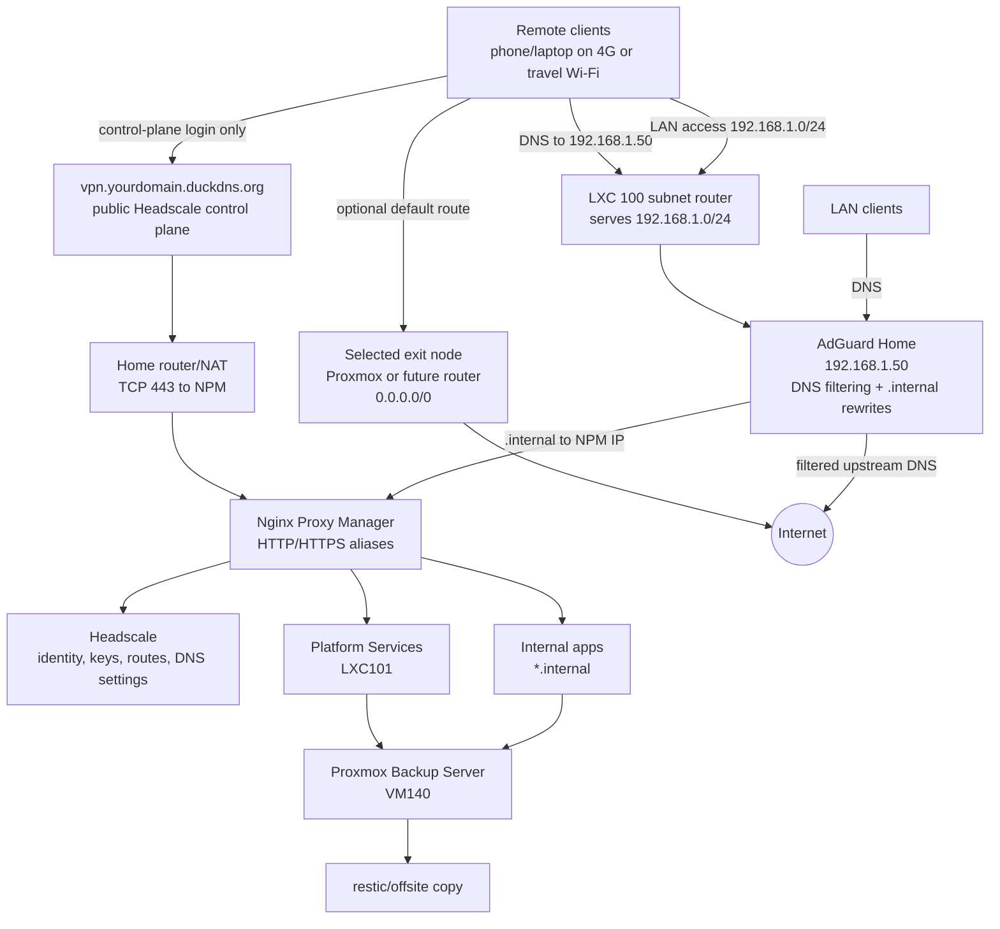

# Sovereign Homelab Operational Procedures and Recovery Plan

This guide is the consolidated operating procedure for the repository. It describes the final architecture, the deployment order, the service interconnections, and the recovery model.

## 1. ITERATION LOG (Traceability)

- **Round 1:** Reloaded the GitHub state, mapped Proxmox/LXC/VM targets, Docker micro-stacks, `.internal` service aliases, and the public Headscale edge.
- **Round 2:** Removed generated agent scratch material, identified unsafe maintenance behavior, and corrected the workflow so updates require validation before mutation.
- **Round 3:** Reconciled service runbooks with official upstream guidance for Immich, Nextcloud AIO, Paperless-ngx, Homepage, RustDesk, Forgejo, and the other defined stacks.
- **Round 4:** Re-audited service visibility, recovery paths, DNS/proxy flow, and data protection rules so every service is either reachable through the documented path or listed as an exception.

## 2. COMPLETE AND DETAILED PROCEDURES (Step-by-Step Guide)

### Layer 0: Repository and Safety Baseline

**Action/Command**

```bash
git status --short --branch
git pull --ff-only origin main
git diff --check
```

**Clear Explanation**

Start every operational session from a clean repository. The repository is the source of truth for stack templates, hostnames, ports, recovery procedures, and validation commands. Fast-forward-only pulls prevent accidental merge commits from hiding operational drift.

**Success Verification**

```bash
git status --short --branch
```

Expected: clean working tree on `main`, aligned with `origin/main`.

### Layer 1: Proxmox Foundation

**Action/Command**

```bash
# Read and apply the sizing plan before creating guests.
less docs/01_proxmox_foundation/HARDWARE_AND_RESOURCE_PLAN.md
less docs/01_proxmox_foundation/CREATE_LXC_RUNBOOK.md
less docs/01_proxmox_foundation/CREATE_VM_RUNBOOK.md
```

**Clear Explanation**

The target host is the P710 with 20 physical CPU cores / 40 logical threads, 64 GB RAM, and 2 TB usable mirrored storage. LXC is preferred for lightweight Docker services. VMs are used for appliance-style or critical workloads such as Immich, Nextcloud AIO, Home Assistant OS, PBS, Jellyfin, and Wazuh.

**Success Verification**

```bash
pvesh get /nodes
pvesm status
qm list
pct list
```

Expected: PVE host reachable, storage online, and planned VM/LXC IDs available or already created.

### Layer 2: Backup Before Production

**Action/Command**

```bash
less docs/05_backup_dr/PBS_CRITICAL_OPERATIONS.md
proxmox-backup-manager datastore list
proxmox-backup-manager verify-job list
proxmox-backup-manager prune-job list
```

**Clear Explanation**

PBS is the recovery backbone. Vaultwarden, Immich, Nextcloud, Paperless, Forgejo, and Home Assistant must not hold real data until backup and restore have been tested. If PBS runs on the same P710 mirror, it is local recovery only; add restic/offsite for disaster recovery.

**Success Verification**

```bash
pvesm status
# Then restore one non-critical guest to a temporary ID and verify it boots.
```

Expected: PBS datastore visible in Proxmox, backup jobs scheduled, verify jobs configured, and at least one restore drill documented.

Live state: PBS VM 140 is deployed at `192.168.1.20`, Proxmox storage `pbs-p710` is active, job `sovereign-core-nightly` backs up guests `100,101,102,103,110,120,130` daily, and LXC 101, LXC 102, LXC 103, VM110, VM120, and VM130 have completed restore drills. VM110 Immich was restored to temporary VM `910`, booted on temporary IP `192.168.1.241`, mounted `/mnt/immich-library`, started healthy Immich containers, returned API `pong`, and was destroyed. This is local recovery because PBS is still on the same P710; add offsite backup before relying on it for disaster recovery. `ssd_pool` was above 90% used during the 2026-06-23 audit, so do not expand photo, media, or file datasets before adding capacity or pruning/migrating data.

### Layer 3: Core Network

**Action/Command**

```bash
cd /opt/core-network
docker compose ps
docker exec headscale headscale configtest
docker exec headscale headscale nodes list
docker exec headscale headscale nodes list-routes
```

**Clear Explanation**

LXC 100 `core-network` runs the core DNS/VPN control plane. AdGuard provides DNS filtering and `.internal` rewrites. Headscale provides the mesh VPN control server. The LXC subnet router advertises `192.168.1.0/24`, and the Proxmox host can act as the full-tunnel exit node.

**Success Verification**

```bash
nslookup dash.internal 192.168.1.50
nslookup vpn.yourdomain.duckdns.org 192.168.1.50
tailscale status
ping 192.168.1.50
```

Expected: `.internal` resolves to NPM, the public VPN name split-resolves to the local endpoint on LAN/VPN, and remote clients can reach the LAN route.

### Layer 4: Public Edge and Internal Aliases

**Action/Command**

```bash
less docs/02_network_vpn/doc_03_nginx_proxy_manager.md
curl -I https://vpn.yourdomain.duckdns.org
curl -I http://dash.internal
```

**Clear Explanation**

Only `vpn.yourdomain.duckdns.org` is public by default. Every web UI uses `.internal` through AdGuard and Nginx Proxy Manager. This model keeps the lab VPN-first while preserving clean service names.

Run the public Headscale check from cellular data or another non-home network. A LAN-only success does not prove that a phone can join from 4G.

**Success Verification**

```bash
curl -I https://vpn.yourdomain.duckdns.org
curl -I http://auth.internal/if/user/
curl -I http://status.internal
curl -I http://dash.internal
```

Expected: public Headscale responds through NPM, and internal aliases respond only from LAN/VPN. During bootstrap, internal aliases are HTTP over LAN/VPN. Move them to private HTTPS after an internal CA is deployed.

### Layer 5: Platform Services

**Action/Command**

```bash
cd /opt/sovereign-homelab/stacks/identity
cp .env.example .env
nano .env
docker compose --env-file .env config --quiet
docker compose --env-file .env up -d

cd /opt/sovereign-homelab/stacks/observability
cp .env.example .env
nano .env
docker compose --env-file .env config --quiet
docker compose --env-file .env up -d
```

**Clear Explanation**

LXC 101 `platform-services` hosts Authentik, Homepage, Uptime Kuma, Beszel, and Dozzle. CrowdSec should run where it can read the live NPM logs; in the current build it runs on LXC 100 with NPM. This layer makes the lab operable: identity, service launchpad, health checks, metrics, logs, and security detection.

**Success Verification**

```bash
curl -I http://auth.internal/if/user/
curl -I http://dash.internal
curl -I http://status.internal
curl -I http://monitor.internal
curl -I http://logs.internal
```

Expected: all platform UIs load through `.internal`, Homepage shows all planned services, and Uptime Kuma monitors are green for deployed services.

Live state: LXC 101 runs Authentik, Homepage, Uptime Kuma, Beszel Hub/agent, and Dozzle. Uptime Kuma has 36 live monitors covering VPN, DNS, core aliases, app aliases including Nextcloud, operations extensions, Home Assistant, Immich, Jellyfin, Open WebUI, CrowdSec LAPI, and key TCP protocol checks. Authentik MFA, recovery policy, and application protection are still deliberate hardening gates.

Optional operations extensions belong after this layer, not before it:

| Extension | Alias | Purpose | Deploy gate |
|---|---|---|---|
| NetAlertX | `netalert.internal` | device inventory and LAN change visibility | live on LXC 103; tune scan scope before alerting |
| Scrutiny | `disks.internal` | SMART disk health visibility | live web/API on LXC 103; Proxmox host collector publishes disk metrics daily |
| ntfy | `alerts.internal` | self-hosted alert delivery | live on LXC 103; add auth/topics before sensitive alerts |

### Layer 6: Application Micro-Stacks

**Action/Command**

```bash
./deploy.sh vaultwarden --pull
./deploy.sh syncthing --pull
./deploy.sh paperless --pull
```

For high-complexity apps, follow the official-first runbooks:

```bash
less docs/04_apps/immich.md
less docs/04_apps/nextcloud.md
less docs/04_apps/home_assistant.md
```

**Clear Explanation**

Each application is isolated in its own `stacks/<service>` directory. This reduces blast radius: updating FreshRSS should not affect Vaultwarden, Immich, or Paperless. Critical apps require app-aware backups in addition to VM/LXC backups.

**Success Verification**

```bash
docker compose --env-file stacks/vaultwarden/.env.example -f stacks/vaultwarden/docker-compose.yml config --quiet
curl -I http://pwd.internal
curl -I http://paper.internal
curl -I http://git.internal
```

Expected: Compose validates, NPM aliases route correctly, Homepage contains the card, and Uptime Kuma has a matching monitor. In the current live build, LXC 102 serves Vaultwarden, Syncthing, Paperless, FreshRSS, Karakeep, SearXNG, Forgejo, RustDesk OSS server, Jellyfin, Ollama, and Open WebUI; VM 110 serves Immich; VM 120 serves healthy Nextcloud AIO through `files.internal` with client-side HTTPS and an upstream AIO Apache port on `11000`; VM 130 serves Home Assistant OS through `ha.internal`.

### Layer 7: Maintenance and Updates

**Action/Command**

```bash
./maintenance.sh
ZFS_DATASET=<your_dataset> ./maintenance.sh --apply
```

**Clear Explanation**

Default maintenance is check-only. `--apply` validates every stack with a real `.env`, optionally snapshots an explicitly configured ZFS dataset, pulls images, and restarts stacks. It never prunes volumes and never deletes application data.

**Success Verification**

```bash
docker ps
docker compose --env-file stacks/observability/.env -f stacks/observability/docker-compose.yml ps
git status --short --branch
```

Expected: containers are healthy or clearly failed in one stack only; repository state remains clean; no anonymous volumes are deleted automatically.

## 3. RECOVERY PLAN & CONNECTION ARCHITECTURE

### Connection Architecture



The operational invariant is simple: Headscale is public only for device login and coordination, AdGuard is authoritative for LAN/VPN DNS, NPM receives only resolved HTTP/S aliases, and an exit node is only the default route to the internet. A phone on 4G must be able to reach `vpn.yourdomain.duckdns.org` through the home router/NAT and NPM before the lab is considered remotely usable. A client may use the Proxmox exit node, but `nslookup example.com 192.168.1.50` and `nslookup dash.internal 192.168.1.50` must still work and appear in the AdGuard query log.

### Recovery Model

| Failure | Recovery path | Verification |
|---|---|---|
| Bad container update | Restore stack files and volumes from PBS/restic; restart only the affected stack | `docker compose ps`, app login, Uptime Kuma green |
| Broken NPM proxy | Test upstream directly, restore NPM `/data` and `/letsencrypt` if needed | `curl -I https://service.internal` |
| DNS failure | Restore AdGuard config; verify rewrites and DHCP state | `nslookup dash.internal 192.168.1.50` |
| VPN control-plane failure | Restore Headscale config/database; confirm routes and clients | `headscale nodes list`, `headscale nodes list-routes` |
| Immich data loss | Restore `UPLOAD_LOCATION` and database from the same timestamp | login, thumbnails, original download, integrity check |
| Vaultwarden data loss | Restore `vaultwarden_data` and offline export if needed | login, attachment test, export test |
| Full host loss | Reinstall Proxmox, restore PBS/offsite copies, restore guests in dependency order | DNS, VPN, NPM, PBS, apps all green |

### Restore Order

1. Proxmox host baseline.
2. PBS or offsite restore access.
3. LXC 100 core-network: AdGuard, Headscale, subnet router.
4. NPM and `.internal` alias routing.
5. LXC 101 platform-services: Authentik, Homepage, Uptime Kuma, Beszel, Dozzle.
6. LXC 103 ops-extensions: NetAlertX, Scrutiny, ntfy.
7. Critical data apps: Vaultwarden, Immich, Nextcloud, Syncthing, Paperless.
8. High-value apps: Home Assistant, Jellyfin, FreshRSS, Karakeep, SearXNG, Forgejo, Open WebUI.
9. Advanced/security services: CrowdSec, Wazuh, RustDesk.

### Authoritative References

- Immich Docker Compose and backup: <https://docs.immich.app/install/docker-compose/>
- Nextcloud AIO reverse proxy: <https://github.com/nextcloud/all-in-one/blob/main/reverse-proxy.md>
- Paperless-ngx setup: <https://docs.paperless-ngx.com/setup/>
- Homepage Docker: <https://gethomepage.dev/installation/docker/>
- RustDesk self-host Docker: <https://rustdesk.com/docs/en/self-host/rustdesk-server-oss/docker/>
