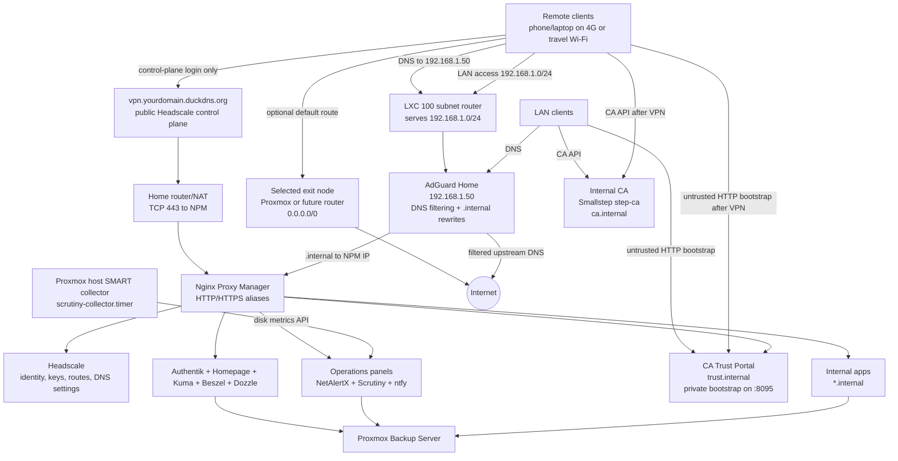

# Sovereign Homelab

Sovereign Homelab is an operational infrastructure manual and stack template repository for a VPN-first, self-hosted home platform. The goal is data sovereignty: DNS, remote access, passwords, photos, files, monitoring, and recovery stay under local control.

The repository is written in English and is designed to be used like an infrastructure runbook, not as loose notes.

## Architecture Rules

- **Only one public default entrypoint:** `vpn.yourdomain.duckdns.org` for Headscale.
- **Private service namespace:** every internal UI uses `.internal`.
- **VPN-first access:** admin and personal services are reached through LAN/VPN and optionally Authentik.
- **Nginx Proxy Manager is the active reverse proxy:** Traefik/Caddy remain future comparisons only.
- **Every web UI must be visible and monitored:** `.internal` alias, NPM proxy host, Homepage card, Uptime Kuma monitor, backup rule, and restore path.
- **Critical data requires restore testing:** Vaultwarden, Immich, Nextcloud, Paperless, Forgejo, and Home Assistant are not production until restore is proven.

The canonical dependency, trust-zone, monitoring, and recovery flows are defined in [Architecture and Data Flows](docs/00_overview/ARCHITECTURE_AND_DATA_FLOWS.md). Read that document before changing DNS, VPN routes, proxy targets, authentication, or backup ownership.

## Target Platform

| Layer | Target |
|---|---|
| Hypervisor | Proxmox VE on P710 |
| Hardware baseline | 20 physical CPU cores / 40 logical threads, 64 GB RAM, 2 TB usable mirrored storage |
| Core network | LXC 100 `core-network`, currently `192.168.1.50` |
| Platform services | LXC 101 `platform-services`, live at `192.168.1.51` |
| Lightweight apps | LXC 102 `apps-light` |
| Operations extensions | LXC 103 `ops-extensions`, live at `192.168.1.53` |
| Critical app VMs | Immich, Nextcloud AIO, Home Assistant OS, PBS, Jellyfin, Wazuh as dedicated VMs when appropriate |

## Live Foundation Status

Last live build log: [2026-07-03](docs/06_operations_security/LIVE_BUILD_LOG_2026-07-03.md).

| Area | Current state |
|---|---|
| VPN | public Headscale endpoint online; DuckDNS public A record updater active on LXC 100; LXC 100 serves `192.168.1.0/24`; Proxmox serves exit node `0.0.0.0/0` and `::/0` |
| DNS | AdGuard resolves `.internal` aliases to NPM on `192.168.1.50` |
| Platform dashboards | Homepage, Uptime Kuma, Beszel Hub/agent, and Dozzle deployed on LXC 101; every web card uses HTTPS and the Proxmox/PBS widgets use dedicated `sole_monitor` read-only API tokens |
| Operations extensions | NetAlertX, Scrutiny, and ntfy deployed on LXC 103 with `.internal` aliases and Kuma monitors; Scrutiny receives SMART data from a Proxmox host-side collector |
| Identity | Authentik is live and remains the source for users, groups, MFA, and app access policy; LDAP/LDAPS is planned only as a compatibility outpost for services such as Proxmox or Linux/SSSD that need directory login |
| Lightweight apps | LXC 102 `apps-light` deployed at `192.168.1.52` with Vaultwarden, Syncthing, Paperless, FreshRSS, Karakeep, SearXNG, Forgejo, RustDesk OSS server, Jellyfin, Ollama, and Open WebUI |
| Immich | VM 110 `immich` deployed at `192.168.1.110`; the data disk currently uses about 91 GB and has a fresh PBS checkpoint, root-only DB/metadata/SHA-256 safety bundle, scheduled app-aware protection, and isolated restore validation; the planned 2 TB removable SSD and a later offsite copy remain required |
| Nextcloud | VM 120 `nextcloud-aio` runs healthy AIO containers at `192.168.1.120`; `files.internal` is HTTPS on the client side and proxies to AIO Apache on port `11000`; full restore drill passed |
| Home Assistant | VM 130 `home-assistant-os` deployed at `192.168.1.130`; `ha.internal` works through NPM after HA proxy trust configuration |
| Monitoring | Uptime Kuma has 38 live monitors covering VPN, DNS, all private aliases, apps, operations extensions, CA health, trust onboarding, and protocol checks |
| Backup | PBS VM 140 deployed at `192.168.1.20`; datastore `p710-local`; Proxmox storage `pbs-p710`; scheduled backup covers guests `100,101,102,103,110,120,130`; LXC 101, LXC 102, LXC 103, VM 110, VM 120, and VM 130 restore drills completed; LXC102 app-aware checks passed for Vaultwarden, Paperless, and Forgejo |
| Internal TLS | Smallstep `step-ca` runs on LXC 101 at `ca.internal:9002`; all 26 private web aliases use one CA-signed certificate with explicit SANs through NPM; `trust.internal` provides managed client onboarding, and weekly renewal plus daily expiry auditing are active |
| Local credentials | root-only credential inventories exist on the Proxmox host; the 2026-06-29 app-login rotation was verified for PBS root and every initialized supported web account except the explicitly excluded AdGuard login; Proxmox and PBS monitoring use non-expiring, revocable `sole_monitor` API tokens with read-only roles, never human/root passwords; public template is [LOCAL_CREDENTIALS_TEMPLATE.md](docs/99_reference/LOCAL_CREDENTIALS_TEMPLATE.md) |
| Alerting and reports | The LXC 101 relay sends Gmail-compatible HTML plus plain-text alerts with one alert, one reminder, and one recovery per incident; a Proxmox timer sends a complete weekly operations report every Monday at 09:00 Europe/Rome and checks certificate, root-account, monitoring-token, and Headscale-node expiration state |
| Host fixes | Intel `e1000e` offload mitigation persisted with `nic0-offload-hardening.service`; stale `zfs-import@TESD` masked after confirming no such pool exists; unused NFS block-layout service disabled; NVIDIA GSP and wireless regulatory firmware installed; Proxmox and service LXCs aligned to the `.internal` search domain |
| Storage model | `ssd_pool` now uses sparse ZFS allocation; thick zvol reservations were cleared after validation, reducing reported usage from about 93% to about 15%. Keep monitoring enabled before large photo, media, and file growth |
| Open gates | Complete CA onboarding on every personal client, commission and test the planned 2 TB removable Immich recovery SSD, add a later offsite photo copy, finish Authentik MFA/app protection policy, and repeat production-data restore rehearsals |

## Network and Access Model



Traffic rules:

- `vpn.yourdomain.duckdns.org` is only the public Headscale control-plane door.
- A phone on 4G must be able to reach `vpn.yourdomain.duckdns.org` through the home router/NAT and NPM before the VPN is considered ready.
- LAN and VPN clients use AdGuard `192.168.1.50` for DNS.
- `.internal` aliases resolve in AdGuard to NPM, then NPM proxies to the real service.
- Selecting an exit node changes the default internet route only; DNS must still go to AdGuard.
- Private app hostnames are never created under DuckDNS.

## Services and Aliases

The source of truth is [Service Visibility Matrix](docs/99_reference/SERVICE_VISIBILITY_MATRIX.md).

| Category | Services |
|---|---|
| Core network | AdGuard, Headscale, Headscale-UI, NPM |
| Admin | Proxmox, PBS |
| Platform | Authentik, Homepage, Uptime Kuma, Beszel, Dozzle, CrowdSec |
| Internal TLS | Smallstep `step-ca` plus `trust.internal` client onboarding for private certificates |
| Operations extensions | NetAlertX, Scrutiny, ntfy |
| Critical data | Vaultwarden, Immich, Nextcloud, Syncthing, Paperless |
| High-value apps | Home Assistant, Jellyfin, FreshRSS, Karakeep, SearXNG, Forgejo, Open WebUI |
| Protocol/API exceptions | RustDesk, Syncthing sync, Forgejo SSH, Ollama API, Wazuh API, CrowdSec LAPI |

## Repository Layout

| Path | Purpose |
|---|---|
| [START_HERE.md](START_HERE.md) | Human reading order |
| [OPERATIONAL_GUIDE.md](OPERATIONAL_GUIDE.md) | Day-2 operating, incident, maintenance, and recovery procedures |
| [docs/00_overview](docs/00_overview) | Roadmap, topology, future ideas |
| [docs/01_proxmox_foundation](docs/01_proxmox_foundation) | Proxmox, sizing, storage, LXC/VM creation |
| [docs/02_network_vpn](docs/02_network_vpn) | AdGuard, NPM, Headscale, exit node, VPN hardening |
| [docs/03_platform_services](docs/03_platform_services) | Authentik, Homepage, Uptime Kuma, Beszel, Dozzle, CrowdSec |
| [docs/04_apps](docs/04_apps) | Per-app runbooks and app index |
| [docs/05_backup_dr](docs/05_backup_dr) | PBS, restore drills, restic/offsite |
| [docs/06_operations_security](docs/06_operations_security) | Operations manual, deployment workflow, security operations |
| [docs/99_reference](docs/99_reference) | Matrices, validation commands, inventory, pinned image versions, and stack catalog |
| [stacks](stacks) | Independent Docker Compose micro-stacks |
| [scripts](scripts) | Operational helper scripts, including the DuckDNS public A record updater |

High-signal reference files:

| File | Purpose |
|---|---|
| [LIVE_SERVICE_COVERAGE.md](docs/99_reference/LIVE_SERVICE_COVERAGE.md) | compact live table for service, alias, NPM, Homepage, Kuma, backup, restore, and gate status |
| [ARCHITECTURE_AND_DATA_FLOWS.md](docs/00_overview/ARCHITECTURE_AND_DATA_FLOWS.md) | canonical trust zones, traffic paths, data classes, dependencies, and invariants |
| [IMMICH_EXTERNAL_SSD_RECOVERY.md](docs/05_backup_dr/IMMICH_EXTERNAL_SSD_RECOVERY.md) | safe 2 TB removable SSD design for full-VM and portable Immich recovery |
| [IDENTITY_ACCESS_MATRIX.md](docs/99_reference/IDENTITY_ACCESS_MATRIX.md) | Authentik groups, SSO method per service, LDAP compatibility scope, and break-glass access model |
| [LOCAL_CREDENTIALS_TEMPLATE.md](docs/99_reference/LOCAL_CREDENTIALS_TEMPLATE.md) | safe public template for the root-only local credentials file |
| [ADMIN_ACCESS_RECOVERY.md](docs/06_operations_security/ADMIN_ACCESS_RECOVERY.md) | safe admin-access recovery runbook for Proxmox, PBS, platform services, Beszel, and apps |
| [FUTURE_IMPROVEMENTS_RESEARCH.md](docs/00_overview/FUTURE_IMPROVEMENTS_RESEARCH.md) | researched future ideas, benefits, risks, and priorities; no live changes |
| [LIVE_BUILD_LOG_2026-06-29.md](docs/06_operations_security/LIVE_BUILD_LOG_2026-06-29.md) | internal HTTPS/NPM migration, `sole_monitor`, HTML alerts, weekly report, and live validation |
| [LIVE_BUILD_LOG_2026-06-30.md](docs/06_operations_security/LIVE_BUILD_LOG_2026-06-30.md) | CA onboarding portal, modern Recovery dashboard, and current Immich data-protection checkpoint |
| [LIVE_BUILD_LOG_2026-07-01.md](docs/06_operations_security/LIVE_BUILD_LOG_2026-07-01.md) | interactive operations dashboard, private Kuma status rollup, scoped widgets, and firewall/VPN architecture decisions |
| [LIVE_BUILD_LOG_2026-07-03.md](docs/06_operations_security/LIVE_BUILD_LOG_2026-07-03.md) | repository refactor, explicit Headscale ACLs, alert coverage, control-room dashboard, and external Immich SSD recovery design |

## Deployment Workflow

1. Read [START_HERE.md](START_HERE.md).
2. Confirm the hardware and guest plan in [HARDWARE_AND_RESOURCE_PLAN.md](docs/01_proxmox_foundation/HARDWARE_AND_RESOURCE_PLAN.md).
3. Build DNS/VPN/proxy from [docs/02_network_vpn](docs/02_network_vpn).
4. Build platform services from [PLATFORM_SERVICES_FROM_EMPTY_LXC.md](docs/03_platform_services/PLATFORM_SERVICES_FROM_EMPTY_LXC.md).
5. Review the identity plan in [Identity Access Matrix](docs/99_reference/IDENTITY_ACCESS_MATRIX.md) before enforcing SSO.
6. Configure PBS and run a restore test using [PBS Critical Operations](docs/05_backup_dr/PBS_CRITICAL_OPERATIONS.md).
7. For Immich, complete the [External SSD Recovery](docs/05_backup_dr/IMMICH_EXTERNAL_SSD_RECOVERY.md) gate before deleting source photos.
8. Deploy one app at a time from [docs/04_apps/00_APP_SERVICES_INDEX.md](docs/04_apps/00_APP_SERVICES_INDEX.md).
9. Add alias, NPM proxy, Homepage card, Uptime Kuma monitor, backup, restore, and rollback for each service.
10. Record or recover admin access using [Admin Access Recovery](docs/06_operations_security/ADMIN_ACCESS_RECOVERY.md).
11. Add optional operations extensions only after the core is green: NetAlertX for asset visibility, Scrutiny for disk SMART, and ntfy for self-hosted alerts.

## Stack Usage

Each app is isolated under `stacks/<service>`:

```bash
cd stacks/<service>
cp .env.example .env
nano .env
docker compose --env-file .env config --quiet
docker compose --env-file .env up -d
docker compose --env-file .env ps
```

Before updating or pulling images, compare the stack against [Pinned Image Versions](docs/99_reference/PINNED_IMAGE_VERSIONS.md). The repository defaults are pinned to tested tags unless the upstream project only publishes an official rolling channel.

Or use the validated wrapper:

```bash
./deploy.sh vaultwarden --pull
```

## Maintenance

Default maintenance is non-destructive:

```bash
./maintenance.sh
```

Apply updates only after backup coverage is verified:

```bash
ZFS_DATASET=<your_dataset> ./maintenance.sh --apply
```

The maintenance script never prunes Docker volumes and never deletes app data.

## Validation

Use [Validation Commands](docs/99_reference/VALIDATION_COMMANDS.md) after every phase.

Minimum repository checks:

```bash
git status --short --branch
git diff --check
```

Minimum service visibility rule:

```text
No alias + no NPM + no Homepage + no Uptime Kuma + no backup = not operational.
```

## Recovery Priority

1. Proxmox baseline.
2. PBS/offsite backup access.
3. LXC 100 core network: AdGuard, Headscale, subnet route.
4. NPM and `.internal` alias routing.
5. Platform services: Authentik, Homepage, Uptime Kuma, Beszel, Dozzle.
6. Operations extensions: NetAlertX, Scrutiny, ntfy.
7. Critical data apps: Vaultwarden, Immich, Nextcloud, Syncthing, Paperless.
8. High-value apps and advanced services.

See [OPERATIONAL_GUIDE.md](OPERATIONAL_GUIDE.md) for the full recovery plan.

For the current single-server failure domain, follow [Immich External SSD Recovery](docs/05_backup_dr/IMMICH_EXTERNAL_SSD_RECOVERY.md). Local PBS and the production VM sharing one P710 is not sufficient disaster recovery.

## Official Reference Set

The runbooks prefer official upstream documentation. Key sources include Immich, Nextcloud AIO, Paperless-ngx, Homepage, Beszel, NetAlertX, Scrutiny, ntfy, Forgejo, RustDesk, Headscale, Tailscale, Proxmox/PBS, and Authentik.
