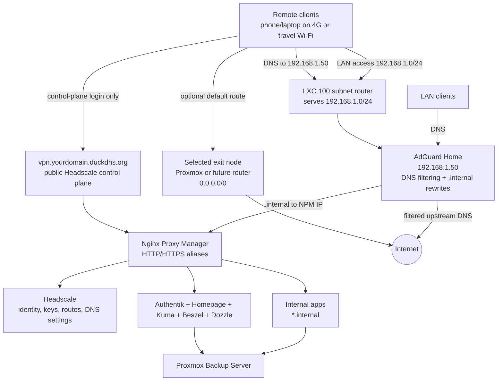

# Sovereign Homelab

Sovereign Homelab is an operational infrastructure manual and stack template repository for a VPN-first, self-hosted home platform. The goal is data sovereignty: DNS, remote access, passwords, photos, files, monitoring, and recovery stay under local control.

The repository is written in English and is designed to be used like an infrastructure runbook, not as loose notes.

## Architecture Rules

- **Only one public default entrypoint:** `vpn.yourdomain.duckdns.org` for Headscale.
- **Private service namespace:** every internal UI uses `.internal`.
- **VPN-first access:** admin and personal services are reached through LAN/VPN and optionally Authentik.
- **Nginx Proxy Manager is the active reverse proxy:** Traefik/Caddy remain future comparisons only.
- **Every web UI must be visible and monitored:** `.internal` alias, NPM proxy host, Homepage card, Uptime Kuma monitor, backup rule, and restore path.
- **Critical data requires restore testing:** Vaultwarden, Immich, Nextcloud, Paperless, Forgejo, and Home Assistant are not production until restore is proven.

## Target Platform

| Layer | Target |
|---|---|
| Hypervisor | Proxmox VE on P710 |
| Hardware baseline | 20 CPU threads, 64 GB RAM, 2 TB usable mirrored storage |
| Core network | LXC 100 `core-network`, currently `192.168.1.50` |
| Platform services | LXC 101 `platform-services` |
| Lightweight apps | LXC 102 `apps-light` |
| Critical app VMs | Immich, Nextcloud AIO, Home Assistant OS, PBS, Jellyfin, Wazuh as dedicated VMs when appropriate |

## Network and Access Model



Traffic rules:

- `vpn.yourdomain.duckdns.org` is only the public Headscale control-plane door.
- LAN and VPN clients use AdGuard `192.168.1.50` for DNS.
- `.internal` aliases resolve in AdGuard to NPM, then NPM proxies to the real service.
- Selecting an exit node changes the default internet route only; DNS must still go to AdGuard.
- Private app hostnames are never created under DuckDNS.

## Services and Aliases

The source of truth is [Service Visibility Matrix](docs/99_reference/SERVICE_VISIBILITY_MATRIX.md).

| Category | Services |
|---|---|
| Core network | AdGuard, Headscale, Headscale-UI, NPM |
| Admin | Proxmox, PBS |
| Platform | Authentik, Homepage, Uptime Kuma, Beszel, Dozzle, CrowdSec |
| Operations extensions | NetAlertX, Scrutiny, ntfy |
| Critical data | Vaultwarden, Immich, Nextcloud, Syncthing, Paperless |
| High-value apps | Home Assistant, Jellyfin, FreshRSS, Karakeep, SearXNG, Forgejo, Open WebUI |
| Protocol/API exceptions | RustDesk, Syncthing sync, Forgejo SSH, Ollama API, Wazuh API, CrowdSec LAPI |

## Repository Layout

| Path | Purpose |
|---|---|
| [START_HERE.md](START_HERE.md) | Human reading order |
| [OPERATIONAL_GUIDE.md](OPERATIONAL_GUIDE.md) | Consolidated procedures, iteration log, connection architecture, recovery plan |
| [docs/00_overview](docs/00_overview) | Roadmap, topology, future ideas |
| [docs/01_proxmox_foundation](docs/01_proxmox_foundation) | Proxmox, sizing, storage, LXC/VM creation |
| [docs/02_network_vpn](docs/02_network_vpn) | AdGuard, NPM, Headscale, exit node, VPN hardening |
| [docs/03_platform_services](docs/03_platform_services) | Authentik, Homepage, Uptime Kuma, Beszel, Dozzle, CrowdSec |
| [docs/04_apps](docs/04_apps) | Per-app runbooks and app index |
| [docs/05_backup_dr](docs/05_backup_dr) | PBS, restore drills, restic/offsite |
| [docs/06_operations_security](docs/06_operations_security) | Operations manual, deployment workflow, security operations |
| [docs/99_reference](docs/99_reference) | Matrices, validation commands, inventory, pinned image versions, and stack catalog |
| [stacks](stacks) | Independent Docker Compose micro-stacks |

## Deployment Workflow

1. Read [START_HERE.md](START_HERE.md).
2. Confirm the hardware and guest plan in [HARDWARE_AND_RESOURCE_PLAN.md](docs/01_proxmox_foundation/HARDWARE_AND_RESOURCE_PLAN.md).
3. Build DNS/VPN/proxy from [docs/02_network_vpn](docs/02_network_vpn).
4. Build platform services from [PLATFORM_SERVICES_FROM_EMPTY_LXC.md](docs/03_platform_services/PLATFORM_SERVICES_FROM_EMPTY_LXC.md).
5. Configure PBS and run a restore test using [PBS Critical Operations](docs/05_backup_dr/PBS_CRITICAL_OPERATIONS.md).
6. Deploy one app at a time from [docs/04_apps/00_APP_SERVICES_INDEX.md](docs/04_apps/00_APP_SERVICES_INDEX.md).
7. Add alias, NPM proxy, Homepage card, Uptime Kuma monitor, backup, restore, and rollback for each service.
8. Add optional operations extensions only after the core is green: NetAlertX for asset visibility, Scrutiny for disk SMART, and ntfy for self-hosted alerts.

## Stack Usage

Each app is isolated under `stacks/<service>`:

```bash
cd stacks/<service>
cp .env.example .env
nano .env
docker compose --env-file .env config --quiet
docker compose --env-file .env up -d
docker compose --env-file .env ps
```

Before updating or pulling images, compare the stack against [Pinned Image Versions](docs/99_reference/PINNED_IMAGE_VERSIONS.md). The repository defaults are pinned to tested tags unless the upstream project only publishes an official rolling channel.

Or use the validated wrapper:

```bash
./deploy.sh vaultwarden --pull
```

## Maintenance

Default maintenance is non-destructive:

```bash
./maintenance.sh
```

Apply updates only after backup coverage is verified:

```bash
ZFS_DATASET=<your_dataset> ./maintenance.sh --apply
```

The maintenance script never prunes Docker volumes and never deletes app data.

## Validation

Use [Validation Commands](docs/99_reference/VALIDATION_COMMANDS.md) after every phase.

Minimum repository checks:

```bash
git status --short --branch
git diff --check
```

Minimum service visibility rule:

```text
No alias + no NPM + no Homepage + no Uptime Kuma + no backup = not operational.
```

## Recovery Priority

1. Proxmox baseline.
2. PBS/offsite backup access.
3. LXC 100 core network: AdGuard, Headscale, subnet route.
4. NPM and `.internal` alias routing.
5. Platform services: Authentik, Homepage, Uptime Kuma, Beszel, Dozzle.
6. Critical data apps: Vaultwarden, Immich, Nextcloud, Syncthing, Paperless.
7. High-value apps and advanced services.

See [OPERATIONAL_GUIDE.md](OPERATIONAL_GUIDE.md) for the full recovery plan.

## Official Reference Set

The runbooks prefer official upstream documentation. Key sources include Immich, Nextcloud AIO, Paperless-ngx, Homepage, Beszel, NetAlertX, Scrutiny, ntfy, Forgejo, RustDesk, Headscale, Tailscale, Proxmox/PBS, and Authentik.
