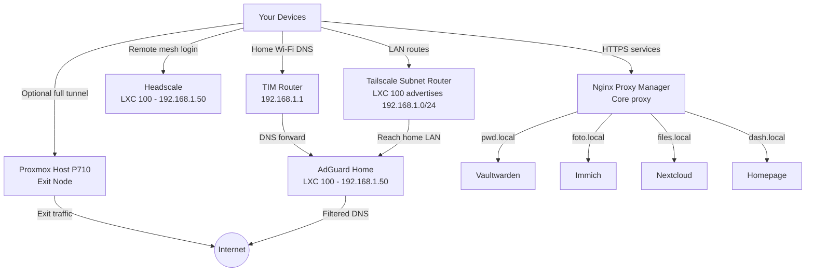

# Sovereign-Homelab

Welcome to **Sovereign-Homelab**, the architecture and documentation for a self-hosted, independent, and secure home network infrastructure.

The goal is data sovereignty: personal control over DNS, passwords, files, photos, remote access, and network traffic without depending on commercial cloud routing for the core home environment.

## Core Philosophy

This homelab is built around three pillars:

1. **Total Local Control**: Core services run locally on Proxmox.
2. **Private Mesh Access**: Remote access is handled through Headscale and Tailscale-compatible clients.
3. **Seamless Internal Access**: Local domains and HTTPS routing are handled through AdGuard Home and Nginx Proxy Manager.

## Architecture Overview

### 1. Gateway Layer

- **AdGuard Home**: Network-wide DNS filtering, local DNS rewrites, and optional DHCP.
- **Headscale**: Private control server for the mesh VPN.
- **LXC 100 Subnet Router**: Advertises `192.168.1.0/24` so remote clients can reach LAN devices.
- **Proxmox Host Exit Node**: Advertises `0.0.0.0/0` so selected clients can send all internet traffic through the home connection.

### 2. Application Layer

- **Nginx Proxy Manager (NPM)**: Reverse proxy and certificate management.
- **Vaultwarden**: Self-hosted password management.
- **Immich**: Photo and video backup.
- **Nextcloud / Syncthing**: File synchronization.

### 3. Monitoring and Management

- **Homepage.dev**: Central dashboard.
- **Uptime Kuma / Beszel**: Service uptime and container/host visibility.
- **Proxmox Backup Server (PBS)**: Deduplicated backups for the infrastructure.

## Network Flow and Topology

## Documentation and Guided Tutorials

- **[00. Master Setup & Docker Compose](docs/doc_00_master_setup.md)**: Build the core Docker stack.
- **[01. Proxmox, Docker & LXC Setup](docs/doc_01_proxmox_docker_lxc.md)**: Prepare the virtualization environment.
- **[02. AdGuard Home Setup](docs/doc_02_adguard_home.md)**: Configure DNS filtering and rewrites.
- **[03. Nginx Proxy Manager](docs/doc_03_nginx_proxy_manager.md)**: Configure HTTPS, reverse proxying, and Headscale routing.
- **[04. Headscale VPN & Device Onboarding](docs/doc_04_headscale_vpn.md)**: Configure Headscale, MagicDNS, clients, and the LXC 100 subnet router.
- **[05. Proxmox Host Exit Node](docs/doc_05_proxmox_exit_node.md)**: Install Tailscale on the physical Proxmox host and advertise it as the full-tunnel exit node.
- **[Infrastructure Plan & Map](docs/infrastructure_plan_and_map.md)**: Current physical/logical layout and roadmap.
- **[Ideas for the Future](docs/ideas_for_the_future.md)**: Advanced personal-network expansion ideas.

---

*Built for Data Sovereignty.*
