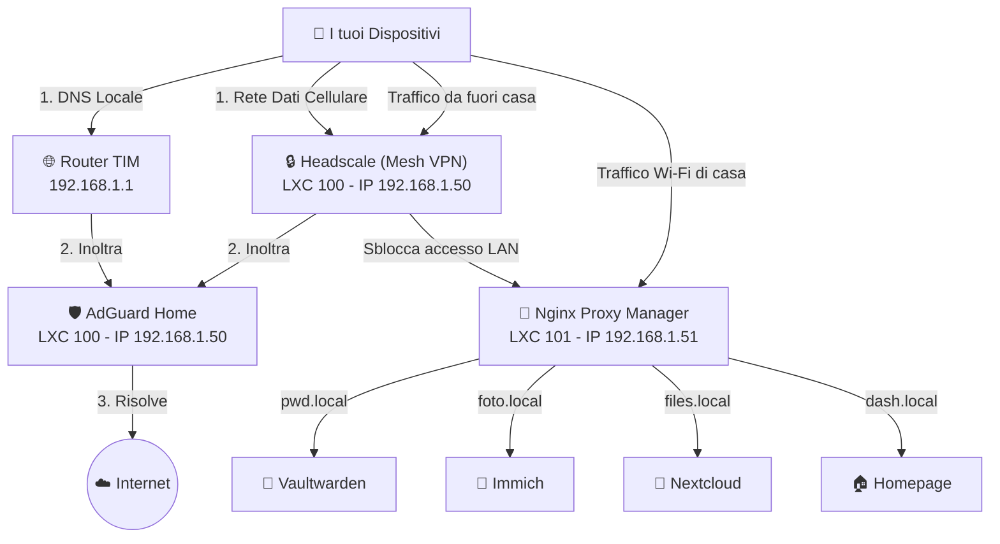

# Sovereign-Homelab: The Ultimate Local Network Core

Welcome to **Sovereign-Homelab**, the definitive and battle-tested guide to building a 100% self-hosted, independent, and secure home network infrastructure.

This repository contains the complete "Golden Triangle" setup for a sovereign homelab:
1. **Total Local Control**: No reliance on commercial external servers for routing or DNS.
2. **Mesh Network VPN**: Peer-to-peer connections using WireGuard protocol via Headscale.
3. **Flawless Mobile Experience**: Overcoming the notorious Tailscale iOS reverse-proxy bugs.

## 🏛️ The Architecture

We use a lightweight, efficient stack running on a single Proxmox LXC container (`core-network`), consisting of:
- **Headscale**: The open-source control server for Tailscale clients (Mesh VPN).
- **AdGuard Home**: Network-wide DNS sinkhole, ad-blocking, and split-brain DNS.
- **Nginx Proxy Manager (NPM)**: Reverse Proxy and automated Let's Encrypt Wildcard SSL via DNS-01 challenges.

## 🚀 The iOS Reverse-Proxy Fix
The Tailscale iOS app heavily relies on WebSocket streams for its Control Protocol (`TS2021` / `noise`). If you are using Nginx Proxy Manager, you MUST:
1. Check the **Websockets Support** toggle on your Proxy Host.
2. Disable `proxy_buffering` in the **Advanced** tab to prevent long-lived streams from timing out.
3. Set your Headscale `server_url` to your public HTTPS domain from the start.
*(See the NPM runbook for the exact configuration).*

## 📚 Runbooks & Documentation

Follow these meticulously tested runbooks to deploy the stack:

- **[01. Proxmox, Docker & LXC Setup](docs/doc_01_proxmox_docker_lxc.md)**: Preparing the virtualization environment.
- **[02. AdGuard Home Setup](docs/doc_02_adguard_home.md)**: Deploying local DNS blocking and rewriting.
- **[03. Headscale VPN & Device Onboarding](docs/doc_03_headscale_vpn.md)**: The core Mesh VPN setup and device registration.
- **[04. Nginx Proxy Manager (The iOS Fixes)](docs/doc_04_nginx_proxy_manager.md)**: Reverse proxy routing, SSL certificates, and critical anti-timeout fixes.
- **[Infrastructure Plan & Map](docs/infrastructure_plan_and_map.md)**: High-level overview of how all these services interact.

## 💡 Pro-Tip for iOS Users
If you still face issues with the official Tailscale app, check out **NovaAccess** on the App Store—a brilliant 3rd-party Tailnet client built specifically for self-hosters.

---
*Built with blood, sweat, and lots of log reading by a dedicated self-hoster.*
