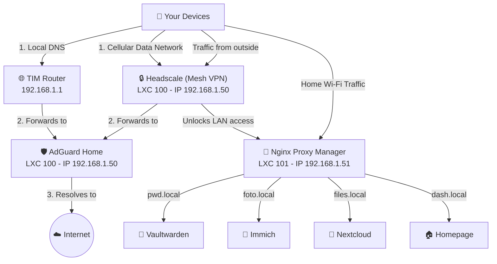

# Sovereign-Homelab 🏰

Welcome to **Sovereign-Homelab**, the high-level architecture and documentation for a 100% self-hosted, independent, and secure home network infrastructure.

The goal of this project is to achieve "Data Sovereignty"—total ownership of personal data, passwords, and media, without relying on commercial cloud providers, while maintaining seamless and secure access from anywhere in the world.

## 🌟 Core Philosophy

This homelab is built around three foundational pillars:
1. **Total Local Control**: Every service runs locally on a Proxmox server. No external dependencies for routing or DNS.
2. **Zero-Trust Mesh Network**: Remote access is strictly handled via a private WireGuard-based Mesh VPN (Headscale), completely invisible to the public internet.
3. **Seamless Experience**: Access to internal services uses elegant local domains (e.g., `foto.local` or `https://vpn.yourdomain.com`) routed flawlessly by a reverse proxy.

## 🏗️ Architecture Overview

The infrastructure is logically separated into distinct layers to ensure security and stability:

### 1. The Gateway Layer (Core Network)
- **AdGuard Home**: Acts as the network-wide DNS sinkhole, blocking ads and trackers before they reach the devices. It also handles local DNS rewrites (split-brain DNS) to direct local traffic efficiently.
- **Headscale**: The open-source control server for Tailscale clients. It establishes a secure, encrypted peer-to-peer mesh network between all devices (PCs, Macs, iOS, Android), allowing them to communicate securely from anywhere in the world.

### 2. The Application Layer (Services)
- **Nginx Proxy Manager (NPM)**: The "traffic cop" of the network. It receives requests and securely routes them to the correct internal service, handling Wildcard SSL certificates automatically via DNS-01 challenges.
- **Self-Hosted Services**:
  - 🔑 **Vaultwarden**: Secure, self-hosted password management.
  - 📸 **Immich**: High-performance photo and video backup.
  - 📁 **Nextcloud / Syncthing**: Cloud storage and file synchronization.

### 3. Monitoring & Management
- **Homepage.dev**: A beautiful, centralized dashboard to monitor the status of all services at a glance.
- **Proxmox Backup Server (PBS)**: Centralized, deduplicated backups for the entire infrastructure to ensure no data is ever lost.

## 🗺️ Network Flow & Topology

The following diagram illustrates how traffic securely flows between external devices, the mesh VPN, and internal services.

## 📚 Documentation & Guides

The deployment process and the underlying philosophy are meticulously documented. If you are new to self-hosting, start with the Zero to Hero guide.

- 🎓 **[Zero to Hero: The Sovereign Homelab Master Guide](docs/Zero_to_Hero_Master_Guide.md)**: A 10-step educational journey explaining the *why* behind every technical choice. Read this first to learn!
- **[00. Master Setup & Docker Compose](docs/doc_00_master_setup.md)**: The ultimate bash script to spin up the entire infrastructure in one go.
- **[01. Proxmox, Docker & LXC Setup](docs/doc_01_proxmox_docker_lxc.md)**: Virtualization environment preparation.
- **[02. AdGuard Home Setup](docs/doc_02_adguard_home.md)**: Deploying local DNS blocking and rewriting.
- **[03. Headscale VPN & Device Onboarding](docs/doc_03_headscale_vpn.md)**: Mesh VPN setup, device registration, and client configuration.
- **[04. Nginx Proxy Manager](docs/doc_04_nginx_proxy_manager.md)**: Reverse proxy routing, SSL certificates, and critical networking fixes for mobile clients.
- **[Infrastructure Plan & Map](docs/infrastructure_plan_and_map.md)**: Detailed mapping of physical and logical layouts.

---
*Built for Data Sovereignty.*
