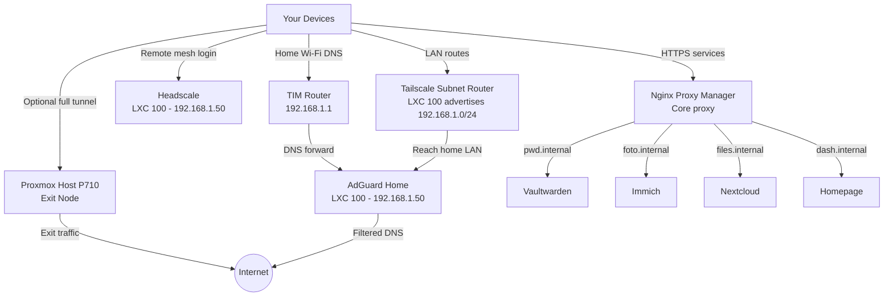

# Sovereign-Homelab

Welcome to **Sovereign-Homelab**, the architecture and documentation for a self-hosted, independent, and secure home network infrastructure.

The goal is data sovereignty: personal control over DNS, passwords, files, photos, remote access, and network traffic without depending on commercial cloud routing for the core home environment.

## Core Philosophy

This homelab is built around three pillars:

1. **Total Local Control**: Core services run locally on Proxmox.
2. **Private Mesh Access**: Remote access is handled through Headscale and Tailscale-compatible clients.
3. **Seamless Internal Access**: `.internal` DNS names and HTTPS routing are handled through AdGuard Home and Nginx Proxy Manager.

## DNS and Access Model

The lab follows a two-zone model:

- **Public edge**: `vpn.yourdomain.duckdns.org` is the only required public hostname, used by remote clients to reach Headscale.
- **Private services**: internal apps use `.internal` names such as `auth.internal`, `dash.internal`, `pwd.internal`, `foto.internal`, and `files.internal`.

DuckDNS is the public door. `.internal` is the private service namespace.

## Architecture Overview

### 1. Gateway Layer

- **AdGuard Home**: Network-wide DNS filtering, local DNS rewrites, and optional DHCP.
- **Headscale**: Private control server for the mesh VPN.
- **LXC 100 Subnet Router**: Advertises `192.168.1.0/24` so remote clients can reach LAN devices.
- **Proxmox Host Exit Node**: Advertises `0.0.0.0/0` so selected clients can send all internet traffic through the home connection.

### 2. Application Layer

- **Nginx Proxy Manager (NPM)**: Reverse proxy and certificate management.
- **Vaultwarden**: Self-hosted password management.
- **Immich**: Photo and video backup.
- **Nextcloud / Syncthing**: File synchronization.

### 3. Monitoring and Management

- **Homepage.dev**: Central dashboard.
- **Uptime Kuma / Beszel**: Service uptime and container/host visibility.
- **Proxmox Backup Server (PBS)**: Deduplicated backups for the infrastructure.

## Network Flow and Topology

## Documentation and Runbooks

- **[Start Here](START_HERE.md)**: Recommended operational path, from base infrastructure to applications.
- **[Roadmap Sovereign Homelab](docs/00_overview/ROADMAP_SOVEREIGN_HOMELAB.md)**: Phases, prerequisites, checklists, and definition of done.
- **[Operations Manual](docs/06_operations_security/OPERATIONS_MANUAL.md)**: Daily, weekly, and monthly routines for keeping the lab healthy.
- **[Inventory and IP Plan](docs/99_reference/INVENTORY_AND_IP_PLAN.md)**: Host, LXC, container, IP, hostname, backup, and criticality inventory.
- **[Deployment Workflow](docs/06_operations_security/DEPLOYMENT_WORKFLOW.md)**: Standard procedure for adding a new service without losing control.
- **[Open Source Stack Catalog](docs/99_reference/STACK_CATALOG_OPEN_SOURCE.md)**: Reasoned catalog of core and optional components.
- **[Top Open Source Stack](docs/99_reference/TOP_OPEN_SOURCE_STACK.md)**: Top-tier catalog for foundation, operations, apps, AI, and security.
- **[Pre-Deploy Checklist](docs/06_operations_security/CHECKLIST_PRE_DEPLOY.md)**: Checklist before installing or updating services.
- **[Ports and DNS Matrix](docs/99_reference/PORTS_AND_DNS_MATRIX.md)**: Ports, hostnames, access model, and DNS rewrites.
- **[Service Visibility Matrix](docs/99_reference/SERVICE_VISIBILITY_MATRIX.md)**: Required alias, NPM proxy, Homepage card, Uptime Kuma monitor, access and backup rule for every service.
- **[Validation Commands](docs/99_reference/VALIDATION_COMMANDS.md)**: Verification commands for Git, Compose, VPN, DNS, apps, and backup.
- **[Troubleshooting Matrix](docs/06_operations_security/TROUBLESHOOTING_MATRIX.md)**: Symptoms, checks, and quick fixes.
- **[00. Master Setup & Docker Compose](docs/01_proxmox_foundation/doc_00_master_setup.md)**: Build the core Docker stack.
- **[01. Proxmox, Docker & LXC Setup](docs/01_proxmox_foundation/doc_01_proxmox_docker_lxc.md)**: Prepare the virtualization environment.
- **[P710 Hardware and Resource Plan](docs/01_proxmox_foundation/HARDWARE_AND_RESOURCE_PLAN.md)**: CPU/RAM/storage plan for the 20-core, 64 GB RAM, 2 TB mirrored host.
- **[Create LXC Runbook](docs/01_proxmox_foundation/CREATE_LXC_RUNBOOK.md)** and **[Create VM Runbook](docs/01_proxmox_foundation/CREATE_VM_RUNBOOK.md)**: Build service containers and appliance VMs from scratch.
- **[02. AdGuard Home Setup](docs/02_network_vpn/doc_02_adguard_home.md)**: Configure DNS filtering and rewrites.
- **[03. Nginx Proxy Manager](docs/02_network_vpn/doc_03_nginx_proxy_manager.md)**: Configure HTTPS, reverse proxying, and Headscale routing.
- **[04. Headscale VPN & Device Onboarding](docs/02_network_vpn/doc_04_headscale_vpn.md)**: Configure Headscale, MagicDNS, clients, and the LXC 100 subnet router.
- **[05. Proxmox Host Exit Node](docs/02_network_vpn/doc_05_proxmox_exit_node.md)**: Install Tailscale on the physical Proxmox host and advertise it as the full-tunnel exit node.
- **[06. Headscale Hardening](docs/02_network_vpn/doc_06_headscale_hardening.md)**: Grants, tags, route auto-approval, audit and OIDC preparation.
- **[07. Identity SSO Authentik](docs/03_platform_services/doc_07_identity_sso_authentik.md)**: SSO, MFA, OIDC and proxy-provider protection.
- **[Platform Services from Empty LXC](docs/03_platform_services/PLATFORM_SERVICES_FROM_EMPTY_LXC.md)**: LXC 101 build path for Authentik, Homepage, Uptime Kuma, Beszel, Dozzle and CrowdSec.
- **[08. Observability Dashboard](docs/03_platform_services/doc_08_observability_dashboard.md)**: Homepage, Uptime Kuma, Beszel and Dozzle.
- **[09. Backup and DR](docs/05_backup_dr/doc_09_backup_dr.md)**: PBS, restore tests, retention and restic offsite.
- **[PBS Critical Operations](docs/05_backup_dr/PBS_CRITICAL_OPERATIONS.md)**: Datastore, backup jobs, verify, prune, garbage collection, restore drills and offsite policy.
- **[10. Core Apps](docs/04_apps/doc_10_core_apps.md)**: Vaultwarden, Immich, Nextcloud AIO and Syncthing.
- **[Application Service Runbooks](docs/04_apps/00_APP_SERVICES_INDEX.md)**: Per-service build, DNS, monitoring, backup, restore and rollback for core and top apps.
- **[11. Security Operations](docs/06_operations_security/doc_11_security_operations.md)**: Update policy, secret rotation, exposure registry, CrowdSec and Wazuh.
- **[Stack Templates](stacks/README.md)**: Docker Compose templates for identity, observability, apps and security.
- **[Infrastructure Plan & Map](docs/00_overview/infrastructure_plan_and_map.md)**: Current physical/logical layout and roadmap.
- **[Ideas for the Future](docs/00_overview/ideas_for_the_future.md)**: Advanced personal-network expansion ideas.

---

*Built for Data Sovereignty.*
