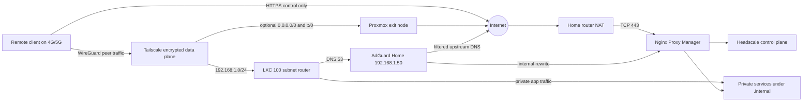
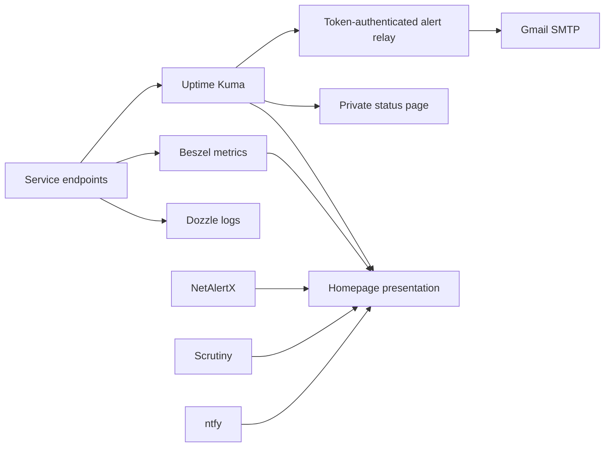
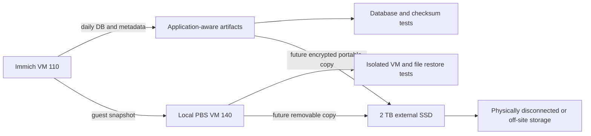

# Architecture and Data Flows

This document is the canonical description of how the Sovereign Homelab works. Use it to understand trust boundaries and dependencies before changing a route, proxy, monitor, backup, or application.

## Design Goals

- A phone must join the private network from 4G/5G before it can resolve private services.
- Only the Headscale control plane is public by default.
- Private web applications use HTTPS aliases under `.internal` and are reachable only from LAN or VPN.
- DNS filtering remains active whether or not a client selects an exit node.
- Monitoring credentials are read-only and separate from human administrator credentials.
- Critical data has both an application-aware recovery path and a guest-level recovery path.
- A failure in presentation services such as Homepage must not affect DNS, VPN, applications, or backups.

## Trust Zones

| Zone | Examples | Trust level | Rules |
|---|---|---:|---|
| Internet | 4G, hotel Wi-Fi, public resolvers | Untrusted | Only TCP 443 to the public Headscale endpoint is accepted by default |
| VPN control plane | DuckDNS, NPM public host, Headscale | Restricted edge | No Authentik or NPM access list may block client enrollment |
| Tailnet | enrolled Tailscale clients | Authenticated | Grants and routes decide what each client can reach |
| LAN | `192.168.1.0/24` | Private, not automatically trusted | AdGuard and NPM are shared infrastructure; admin access still needs authentication |
| Management | Proxmox, PBS, NPM, AdGuard, Headscale UI | P0 administrative | LAN/VPN only, HTTPS, local break-glass account retained |
| Application | Vaultwarden, Immich, Nextcloud, Paperless, Forgejo | Mixed P0/P1 data | LAN/VPN only unless a documented exception is approved |
| Backup | PBS and future removable SSD | P0 recovery | Backup credentials cannot administer production; restore tests are mandatory |
| Secret store | `/root/sovereign-secrets` | P0 confidential | Root-only, never served by NPM, never committed to Git |

## Authoritative Traffic Flows



### Public VPN enrollment

```text
phone on 4G/5G
  -> public DNS resolves vpn.yourdomain.duckdns.org
  -> router forwards TCP 443 to NPM
  -> NPM proxies only this hostname to Headscale:8080
  -> client receives tailnet identity, DNS, and approved routes
```

The public endpoint is a coordination service. Normal application payloads do not pass through Headscale.

### Private DNS and application access

```text
LAN or connected VPN client
  -> DNS query to AdGuard 192.168.1.50
  -> AdGuard rewrites <service>.internal to NPM
  -> client opens HTTPS <service>.internal
  -> NPM terminates internal TLS and proxies to the documented upstream
```

Infrastructure nodes use `--accept-dns=false` to avoid routing their own resolver through the service they provide. Personal clients accept the DNS configuration pushed by Headscale.

### Optional exit-node use

```text
client default internet traffic -> selected exit node -> home internet connection
client DNS traffic             -> AdGuard 192.168.1.50
```

Selecting the exit node must not replace AdGuard with a public resolver. Validate both the changed public IP and the corresponding query in the AdGuard log.

### Monitoring and alert delivery



Homepage is a presentation layer, not the monitoring authority. Uptime Kuma owns availability state. Beszel owns host metrics. Scrutiny owns SMART state. A broken dashboard must not suppress alerts.

### Backup and recovery



Local PBS is recovery from software failure and accidental deletion, but it is not disaster recovery while it shares the P710. The external SSD becomes the second physical medium only while it is disconnected or stored away from the server after a verified backup.

## Data Classification

| Class | Data | Maximum acceptable loss | Required protection |
|---|---|---:|---|
| P0 irreplaceable | Immich originals, Vaultwarden vault, personal documents | One backup interval or less | app-aware backup, PBS backup, separate physical copy, tested restore, alerting |
| P0 control | CA keys, root-only credentials, Headscale keys/database | One configuration change | encrypted root-only backup, break-glass procedure, tested rebuild |
| P1 important | Nextcloud, Paperless, Forgejo, Home Assistant | One day | app-aware backup plus PBS and periodic restore |
| P2 reproducible | Homepage, Kuma config, Compose templates | Several days | Git plus PBS; rebuild is acceptable |
| P3 cache | thumbnails, transcoded media, downloaded models | No strict guarantee | back up only when regeneration cost justifies it |

## Dependency Order

1. Proxmox host, storage, and bridge.
2. LXC 100: AdGuard, NPM, Headscale, subnet route.
3. Public Headscale reachability from 4G/5G.
4. Proxmox exit node and DNS-through-AdGuard validation.
5. PBS and one isolated restore.
6. LXC 101: Authentik, Homepage, Kuma, Beszel, Dozzle, internal CA.
7. LXC 103 operations extensions and alert delivery.
8. P0/P1 applications one at a time, each with backup and restore proof.

## Invariants Checked After Every Change

- Public DuckDNS exposes only Headscale.
- `.internal` is never published in public DNS.
- NPM is the only browser-facing reverse-proxy authority.
- LXC 100 serves only `192.168.1.0/24`; Proxmox serves only the exit routes.
- Personal clients accept AdGuard DNS; infrastructure routers do not.
- Every web UI has an alias, NPM host, Homepage card, Kuma monitor, backup owner, and recovery path.
- No human password is used by a dashboard widget.
- No secret appears in Git, rendered Homepage HTML, or service logs.
- Immich originals are never modified by backup scripts.
- Production restore operations are never tested over the production guest.

## Change Control

Before changing a dependency:

1. Identify its upstream and downstream services in this document.
2. Confirm a current backup and a rollback command.
3. Change one layer only.
4. Run the repository validation and live audit.
5. Test the user path, not only the container health check.
6. Record observed reality in the canonical runbook; use build logs only as historical evidence.

## Sources

- [Headscale routes](https://headscale.net/stable/ref/routes/)
- [Headscale policy](https://headscale.net/stable/ref/acls/)
- [Immich backup and restore](https://docs.immich.app/administration/backup-and-restore/)
- [Proxmox Backup Server storage](https://pbs.proxmox.com/docs/storage.html)
- [Homepage services and monitors](https://gethomepage.dev/configs/services/)

---

**Previous:** [Infrastructure Plan and Map](infrastructure_plan_and_map.md)
**Next:** [Roadmap](ROADMAP_SOVEREIGN_HOMELAB.md)
