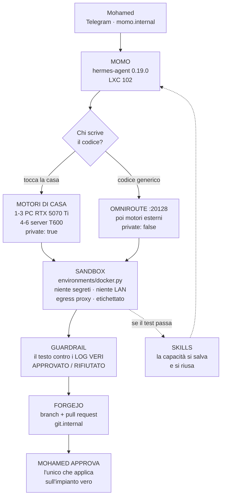

# Momo che programma — l'architettura

> Scritto il **2026-08-04**, su richiesta del proprietario: *«Momo, quando è
> collegato a OmniRoute, deve poter programmare e fare tutto così come lo fai
> tu»*, con tre domande dentro: serve **Ponytail**? serve **Ruflo**? si può
> mettere **Claude o un modello a token gratis** dentro Momo?
>
> Tutto ciò che segue sullo stato attuale è stato **verificato sul vivo** il
> 2026-08-04 dentro LXC 102, non dedotto dalla documentazione.

---

## 1. La risposta corta

**Momo non ha bisogno di un secondo agente di programmazione. Ne ha già uno
sotto il cofano, e non è mai stato acceso.**

`hermes-agent` 0.19.0 — il codice su cui Momo gira — contiene un terminale
vero, l'esecuzione di codice, la gestione dei file, la delega a sotto-agenti,
una libreria di *skill* riusabili, un client MCP, e **sette ambienti sandbox**
fra cui Docker e SSH. Nella configurazione di Momo oggi c'è scritto:

```yaml
toolsets: [sovereign, file, memory, clarify, todo, vision]
skills: {enabled: false}
```

Cioè: di tutto quell'impianto, Momo usa i file, la memoria e gli occhi. Il
resto è installato e spento.

Quindi la domanda giusta non è «quale agente aggiungiamo», ma **«cosa
accendiamo, con quali guardie, e chi scrive il codice quando il modello di
casa non ce la fa»**.

## 2. La scoperta, in tabella

Verificato dentro `/opt/hermes-agent-study/tools/` il 2026-08-04.

| Toolset del motore | Cosa dà | Momo oggi |
|---|---|---|
| `code_execution` | esegue codice in un ambiente isolato, con `check_sandbox_requirements()` e `_get_or_create_env(task_id)` | **spento** |
| `terminal` | un terminale vero: `terminal_tool.py` è 3 220 righe, `process_registry.py` 2 418, con letture, pannelli, chiusura | **spento** |
| `delegation` | sotto-agenti e deleghe asincrone (`delegate_tool.py`, `async_delegation.py`) | **spento** |
| `skills` | `skill_manager_tool.py` + `skills_tool.py`: **crea, salva e riusa capacità** | **spento** (`skills.enabled: false`) |
| `cronjob` | controlli programmati (`cronjob_tools.py`) | **spento** |
| `browser` | pilota un browser vero (`browser_cdp_tool.py`, Camofox) | **spento** |
| `project`, `session_search` | contesto di progetto, ricerca nelle sessioni | **spento** |
| `computer_use` | usa il desktop | **spento**, e va lasciato spento |
| `homeassistant` | strumenti Home Assistant nativi | **spento** — e HA in casa c'è (VM 130) |
| `file`, `memory`, `vision`, `todo`, `clarify` | quello che Momo usa oggi | acceso |

E gli **ambienti sandbox** già scritti, in `tools/environments/`:

```
base.py  docker.py  ssh.py  local.py  singularity.py
modal.py  managed_modal.py  daytona.py  vercel_sandbox.py  file_sync.py
```

`docker.py` contiene già `reap_orphan_containers()` — **il teardown
automatico** — e `_egress_proxy_args_for_docker()`, cioè il controllo di cosa
il sandbox può raggiungere in uscita.

### Cosa significa per il piano Digital Twin

Le voci 7, 8, 9, 10 del [PIANO_MOMO_DIGITAL_TWIN](PIANO_MOMO_DIGITAL_TWIN.md)
— Automation Library, riciclo degli script, ciclo di vita delle sandbox,
auto-salvataggio — sono state scritte come «da costruire». **Non vanno
costruite: vanno configurate e circondate di guardie.** `skills` *è* la
libreria di automazione; `environments/docker.py` *è* il ciclo di vita.

Questo è il tipo di scoperta che si fa solo leggendo il codice, ed è il motivo
per cui la regola di casa dice di leggere il codice e non le note di rilascio.

## 3. Quello che NON si accende, e perché

Prima dell'architettura, il limite. **LXC 102 è il posto peggiore del mondo
dove dare un terminale a un modello linguistico**: lì dentro ci sono
Vaultwarden, Postgres, Qdrant, CouchDB, le chiavi in
`/root/sovereign-secrets/`, e Momo stesso.

Quindi tre divieti, che valgono per costruzione e non per buona volontà:

1. **Il codice di Momo non gira mai sul filesystem di LXC 102.** Gira dentro un
   container dedicato, senza montaggi dei segreti, senza la rete di casa, con
   l'egress proxy acceso. `environment: local` resta vietato.
2. **Il divieto assoluto di MASTER non si tocca**: `qm destroy`, `zfs destroy`,
   `rm -rf`, disattivare le guardie, Immich. Sandbox o no, sono vietati sulla
   guardia dell'host, che ha 29 casi verificati.
3. **Il teardown distrugge solo ciò che ha creato lui.** Non «ciò che si
   chiama così»: solo identificatori presi dal registro dell'orchestratore.
   `reap_orphan_containers()` lavora per etichetta, il che è la forma giusta —
   ma l'etichetta va imposta da noi, non accettata dal modello.

E `computer_use` resta spento: un modello che muove il mouse sul desktop del
proprietario non ha un guadagno che giustifichi quel rischio.

## 4. L'architettura — quattro anelli



### Anello 1 — dove gira il codice: la sandbox

`environment: docker`, immagine dedicata, e per costruzione:
niente `/root/sovereign-secrets`, niente rete `192.168.1.0/24`, egress solo
verso i pacchetti (PyPI, apt, npm) attraverso il proxy, un'etichetta
`sovereign.momo.sandbox=<task_id>` su ogni container, e un tetto di durata.

Il registro di ciò che ha creato lo tiene **l'orchestratore Python**, non il
modello. È la sola forma onesta di «può cancellare le robe che crea lui».

### Anello 2 — chi scrive: il router, e OmniRoute

Programmare è il compito dove i modelli piccoli **collassano**: `qwen2.5:3b`
non scrive un playbook Ansible che funziona. Quindi il codice non si chiede al
motore che capita, si instrada:

| Il compito | Chi lo prende | Perché |
|---|---|---|
| tocca l'impianto, i dati, i segreti | **motore di casa** (PC, poi T600) | `private: true`: la casa non esce |
| codice generico, algoritmi, un file di test | **OmniRoute → motore esterno** | qui serve il modello più forte, e non c'è niente da proteggere |
| il compito non è chiaro | si chiede, non si indovina | esiste già `clarify` |

**Il ruolo di OmniRoute finalmente si vede.** Finora era «il terzo anello dopo
la GPU del server» (voce T2, mai fatta): un anello in più senza un lavoro suo.
Con la programmazione diventa **il commutatore dei modelli forti**, ed è già
vivo e già chiuso — verificato oggi: porte 20128/20132 filtrate in
`DOCKER-USER` a tre soli indirizzi, e risponde `401` senza chiave.

La regola `private` non si allenta: un motore esterno continua a vedere **1
strumento su 20**. Un compito instradato fuori riceve l'*enunciato* del
problema, mai il contesto di casa.

### Anello 3 — dove finisce: Forgejo, con un umano in mezzo

Il codice che Momo scrive **non si applica da solo sull'impianto vero.** Esce
come *branch* e *pull request* su Forgejo (`git.internal`, già in casa), e il
proprietario approva. Il modello ha il permesso di **proporre**; l'unico che
**applica** è lui.

Questo non è un freno temporaneo da togliere quando ci si fida: è la stessa
forma che ha MASTER, che è arrivato dopo cinque guardie e con un divieto
assoluto compilato a codice.

### Anello 4 — chi verifica che non menta: il Guardrail, esteso

Il [Guardrail](../04_apps/momo-guardrail.md) esiste, ha 23 casi di test, e oggi
prende le bugie sulle *scritture* («ho mandato la mail» senza invio). Con la
sandbox nasce una bugia nuova e più pericolosa: **«il test è passato» quando i
log dicono il contrario**. È esattamente il caso che il documento originale
chiedeva alla Fase 4, ed è la ragione per cui `<automation_commit>` deve
dipendere dall'esito reale, non dal parere del modello.

Regola: **il salvataggio in `skills` lo decide l'orchestratore leggendo il
codice di uscita**, mai il modello dicendo che è andata bene.

## 5. I verdetti sulle tue domande

| | Verdetto | Il perché |
|---|---|---|
| **Ruflo** (ex claude-flow, ruvnet) | **studiare, non installare — ancora** | è un *meta-harness*: orchestra Claude Code, Codex e **Hermes** con oltre 100 agenti nominati. Il suo pezzo utile **subito e a costo zero** è il **catalogo dei ruoli**: noi ne abbiamo 13, loro 100+, e copiare delle definizioni non aggiunge nessun servizio. Metterlo *in mezzo* alla catena invece è un impianto Node+Rust che si muove in fretta, davanti all'assistente di casa: si legge il codice prima, come si è fatto con hermes-agent |
| **Ponytail** | **SÌ, e ora anche dentro Momo** | ieri la risposta era «solo sul PC», perché Momo non scriveva codice. Il giorno che scrive, Ponytail è una *skill* — e il toolset `skills` è esattamente il posto dove va. Costa zero: si installa, si guarda una settimana, si tiene o si toglie |
| **RooFlow** | **NO** | è la «memory bank» di Roo Code: una cartella di markdown che l'assistente rilegge a ogni sessione, per un'estensione di VS Code. Momo ha già una memoria **più forte** (Postgres + Qdrant + Valkey, con ricerca per significato). Sarebbe un passo indietro in una forma più povera |
| **Claude dentro Momo** | **SÌ, come motore 9, `private: false`** | via OpenRouter. Ma va detto chiaro: è **a pagamento e fuori casa**, quindi vale per il codice generico e mai per l'impianto. Il gratis vero resta il PC: un `qwen2.5-coder:14b` sulla 5070 Ti scrive codice utile, è in casa, e non ha un contatore |
| **Token gratis** | **c'è già, ed è il motore 7** | `openai/gpt-oss-20b:free` su OpenRouter. I «free» cambiano nome e limiti in continuazione: si sceglie il giorno che serve, non si scrive in un piano |
| **OmniRoute** | **SÌ, e finalmente ha un lavoro** | vedi anello 2. Era la voce T2 senza uno scopo proprio: adesso è il commutatore dei modelli forti per il codice |

## 6. Il punteggio del Digital Twin, ricontato il 2026-08-04

Il conteggio del 2026-08-01 diceva **1 su 11**. Rifatto oggi, cercando nel
codice e non nella memoria:

| # | Voce | Stato | Nota |
|---|---|---|---|
| 1 | Doppio RAG / astrazione | ❌ | zero righe nostre, il Sinker Fase 1 non esiste |
| 2 | Tool statistico (ARIMA) | ❌ | zero righe. Chiude anche A6 di Nexi |
| 3 | Apprendimento continuo (download → Qdrant) | ❌ | zero righe. La memoria automatica impara dai **turni**, non dai file |
| 4 | Voce real-time (LiveKit, barge-in) | ❌ | — |
| 5 | STT Faster-Whisper | ✅ **fatto** | `stt.local.model: medium`, lingua riconosciuta da sola |
| 6 | TTS | ✅ **fatto con Piper** | `it_IT-paola-medium`. XTTS-v2 (la sua voce) resta da fare: servono le registrazioni |
| 7 | Automation Library | 🟡 **esiste nel motore, spenta** | `skill_manager_tool.py` + `skills_tool.py`, `skills.enabled: false` |
| 8 | Riciclo degli script | 🟡 **idem** | è la stessa cosa della 7 |
| 9 | Sandbox lifecycle | 🟡 **esiste nel motore, spento** | `environments/docker.py`, con `reap_orphan_containers()` già scritto |
| 10 | Auto-salvataggio | 🟡 **idem** | ma la decisione va tolta al modello e data all'orchestratore |
| 11 | Guardrail | ✅ **fatto** | 23 casi di test |

**Conto onesto: 3 fatte, 4 già costruite da NousResearch e da accendere, 4 da
scrivere davvero.** Non è 1 su 11, e non è nemmeno 7 su 11: le quattro gialle
sono *motori*, e attorno a un motore acceso senza guardie ci si fa male.

E le tre fasi del Sinker (1 SINK, 2 COMPUTE, 3 SURFACE) restano da fare — con
il caveat già scritto nel piano: tre chiamate al modello hanno senso **con la
GPU**, e la GPU del server adesso c'è.

## 7. L'ordine dei lavori

| Onda | Cosa | Perché in quest'ordine | ⏱ |
|---|---|---|---|
| **P1** | ✅ **fatto 2026-08-04** — [momo-sandbox.md](../04_apps/momo-sandbox.md): rete Docker dedicata (172.30.0.0/24, icc=false), firewall DOCKER-USER contro la LAN, guardiano TTL (2h) per i container `sleep infinity` che `reap_orphan_containers()` non tocca mai. Provato dal vivo: 4 bersagli LAN in timeout, Internet raggiunto, nessun `docker.sock`/segreto montato, teardown reale su 1 container senza toccare gli altri 22 | si costruisce la gabbia prima di metterci dentro qualcosa. Ed è la sola parte che, se sbagliata, si paga cara. **Scoperta**: il codice dava per scontati un egress-proxy già acceso e un teardown che copre i container `running` — nessuno dei due è vero, letto in `docker.py` | ~4 h stimate, **non ancora misurate** |
| **P2** | 🟡 **provato dal vivo 2026-08-04, non acceso in modo permanente** — [momo-sandbox.md](../04_apps/momo-sandbox.md) §9-bis/§12. Trovato e aggirato un bug reale in hermes-agent (`docker_extra_args` non arriva mai al container in `code_execution_tool.py`/`file_tools.py`); il firewall copre comunque entrambe le reti possibili. Trovato anche un conflitto architetturale vero: `execute_code` e il toolset `file` (già in uso da Momo oggi, 7 sessioni reali verificate) condividono lo stesso ambiente — accendere `terminal.backend: docker` in modo permanente romperebbe `read_file`/`write_file` su percorsi reali. **Decisione del proprietario richiesta prima di procedere**: tre strade in §12 | il primo momento in cui Momo esegue qualcosa. Va guardato, non dedotto — e infatti guardandolo si è trovato un bug vero | ~2 h stimate, **oltre 3h spese**, tempo extra dai due difetti trovati |
| **P3** | **Estendere il Guardrail all'esito dei test**: «è passato» si confronta con il codice di uscita vero | prima che esista un `automation_commit` da salvare. Salvare uno script che il modello *crede* funzionante è come scriversi un fatto sbagliato in memoria: resta | ~3 h |
| **P4** | **Accendere `skills`** = la Automation Library (voci 7, 8, 10), con il salvataggio deciso dall'orchestratore | dopo P3, mai prima | ~3 h |
| **P5** | **Il router del codice**: compito che tocca la casa → motore di casa; generico → OmniRoute. E `qwen2.5-coder:14b` sul PC | senza questo, il codice lo scrive `qwen2.5:3b` e non funziona | ~3 h |
| **P6** | **Forgejo come uscita**: branch + PR, mai `git push` su main, mai applicazione diretta | è l'anello che tiene un umano nel mezzo | ~3 h |
| **P7** | **Ponytail come skill**, dentro Momo | ha bisogno di P4 | ~1 h |
| **P8** | **Leggere il codice di Ruflo** e riferire cosa regge — a partire dagli agenti e dall'integrazione Hermes | è già il punto 19 del [PIANO_GENERALE](PIANO_GENERALE.md) | ~4 h |
| **P9** | **`delegation` + i 13 ruoli**, con i tre freni del §3.6 del Digital Twin (tetto di salti, rilevamento cicli, catalogo nostro) | un grafo senza freni non termina | ~5 h |
| **P10** | **`cronjob`**: i controlli programmati, che è già la voce 8 di PIANO_MASTER §2-bis | riusa un motore già presente invece di scriverne uno | ~2 h |

Fuori fila, e da non dimenticare: **`homeassistant` è un toolset nativo del
motore** e in casa c'è la VM 130. È probabilmente la cosa più utile per meno
lavoro di tutto questo elenco — va misurata contro il nostro strumento
attuale prima di accenderla.

## 8. Le tre cose che possono andare storte

Scritte prima, non dopo.

1. **Un modello con un terminale è un modello con un terminale.** Le guardie
   che abbiamo sono buone per la *chat*; una shell è un'altra categoria. La
   sandbox va provata **cercando di uscirne** — dal container verso
   192.168.1.52, verso `/root`, verso i database — e il risultato va scritto.
2. **`skills` è memoria eseguibile.** Un fatto sbagliato in memoria dà una
   risposta sbagliata; uno script sbagliato in libreria si **esegue**, e si
   riesegue ogni volta che il compito somiglia. Per questo P3 viene prima di P4.
3. **Il costo nascosto è la latenza.** Ogni anello in più (sandbox che parte,
   modello forte da chiamare, Guardrail che verifica) allunga la risposta. Un
   assistente che impiega un minuto a rispondere non lo usa nessuno. Va
   misurato, e se serve la via corta resta per le domande normali.

## 9. Sorgenti

- Verifiche del 2026-08-04 dentro LXC 102: `/opt/hermes-agent-study/tools/`, `tools/environments/`, `/opt/momo/home/.hermes/config.yaml`, `iptables -S DOCKER-USER`
- [ruvnet/ruflo](https://github.com/ruvnet/ruflo) — il meta-harness, ex claude-flow
- [DietrichGebert/ponytail](https://github.com/DietrichGebert/ponytail) — la skill che fa scrivere meno codice
- [GreatScottyMac/RooFlow](https://github.com/GreatScottyMac/RooFlow) — la memory bank di Roo Code
- [PIANO_MOMO_DIGITAL_TWIN.md](PIANO_MOMO_DIGITAL_TWIN.md) — il documento del proprietario, e il punteggio
- [momo-guardrail.md](../04_apps/momo-guardrail.md) — la difesa anti-bugia da estendere
- [VALUTAZIONE_TECNOLOGIE_2026-08.md](VALUTAZIONE_TECNOLOGIE_2026-08.md) — le tredici tecnologie del 4 agosto
