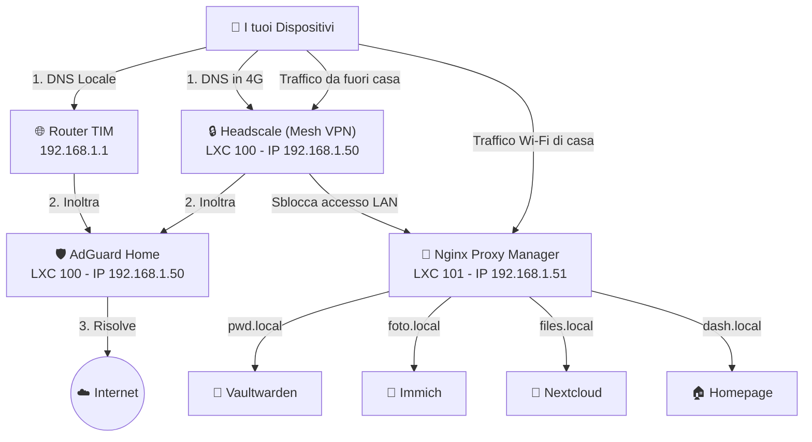
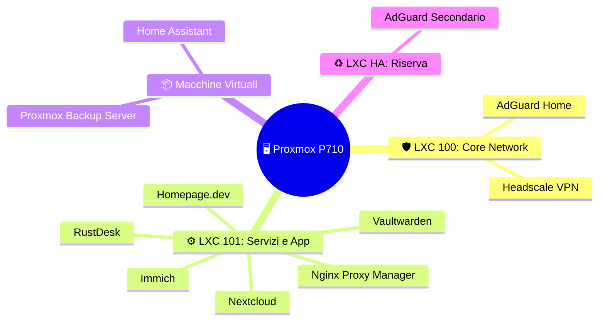
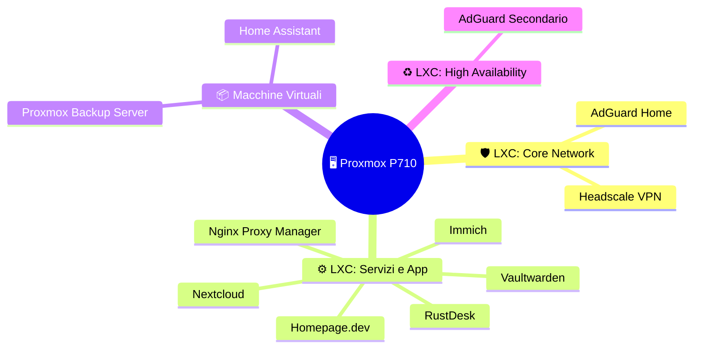

# Piano dell'Infrastruttura e Mappa del Server (Homelab)

## Mappa Architetturale

Questa mappa descrive come i vari servizi interagiranno tra di loro e come i dati fluiranno all'interno e all'esterno della tua rete domestica.

Per evitare il "groviglio di cavi" visivo che si crea quando si mescolano connessioni di rete e scatole fisiche, ho diviso la mappa in due schemi molto più chiari e puliti.

### 1. Come viaggiano i dati (Flusso di Rete)
Questa mappa mostra semplicemente chi parla con chi.

### 2. Architettura Fisica (Dove si trovano)
Questa mappa ad albero mostra la separazione fisica delle reti senza incrociare linee.

### 2. Come sono installati (Architettura Proxmox)
Questa mappa mostra esattamente dove "vivono" fisicamente i servizi all'interno del tuo server.

## Piano d'Azione (Fasi di Implementazione)

### Fase 1: Le Fondamenta (Accesso Remoto e Rete) - IN CORSO
- **Obiettivo**: Sicurezza, privacy e accesso da remoto senza esporre porte al pubblico.
- **Servizi**:
  - **Headscale**: Il centro di controllo per Tailscale. Permette di creare la tua VPN in modo che tutti i tuoi dispositivi possano "vedersi" in modo sicuro.
  - **AdGuard Home**: Blocca pubblicità e traccianti a livello DNS. Imposteremo il router in modo che distribuisca questo DNS a tutti i dispositivi connessi in casa.
  - **LXC AdGuard Secondario + Keepalived**: Installeremo un secondo container LXC sempre su Proxmox con Keepalived. Se il container principale si blocca, il traffico DNS passa istantaneamente a quello di riserva.

### Fase 2: Inoltro Traffico e Servizi Core (Gestione Dati)
- **Obiettivo**: Gestire i propri dati al sicuro e accedere ai servizi tramite nomi semplici (es. `foto.local`) e con certificati sicuri.
- **Servizi**:
  - **Nginx Proxy Manager (NPM)**: Il "vigile urbano" della rete. Riceve il traffico e lo smista al servizio corretto.
  - **Vaultwarden**: Il gestore di password. Sostituisce i servizi in cloud come 1Password o Bitwarden.
  - **Immich**: Per il backup automatico delle foto, l'alternativa self-hosted a Google Foto.
  - **Nextcloud / Syncthing**: Per la sincronizzazione di file tra dispositivi.

### Fase 3: Monitoraggio e Dashboard
- **Obiettivo**: Avere il polso della situazione di tutto il server con una bella interfaccia grafica e ricevere allarmi se qualcosa si rompe.
- **Servizi**:
  - **Homepage**: La dashboard centrale stupenda (gethomepage.dev) per avere tutto sott'occhio.
  - **Beszel**: Per monitorare graficamente l'utilizzo di CPU e RAM di ogni singolo container Docker.
  - **Uptime Kuma**: Per pingare continuamente i servizi. Se Vaultwarden va offline, ricevi un messaggio su Telegram o Discord.

### Fase 4: Backup e Controllo Remoto
- **Obiettivo**: Mettere in sicurezza i dati e poter assistere altri PC da remoto.
- **Servizi**:
  - **Proxmox Backup Server (PBS)**: Con deduplicazione attivata per fare backup rapidi ed efficienti di tutto l'host e dei container. Lo installeremo come **VM dedicata su Proxmox** (niente macchine fisiche separate, tutto centralizzato).
  - **RustDesk**: Per il controllo remoto dei tuoi dispositivi, sostituendo TeamViewer.

### Fase 5: Identità ed Espansione Futura
- **Obiettivo**: Autenticazione centralizzata. Un solo login per accedere a tutti i servizi.
- **Servizi**:
  - **Authelia o Authentik**: Implementazione del Single Sign-On (SSO). Quando accederai a `foto.local`, verrai reindirizzato a una pagina di login centrale.
  - **Home Assistant**: Domotica (può essere installato su Proxmox come VM OS per avere il pieno controllo di supervisor e add-on).
