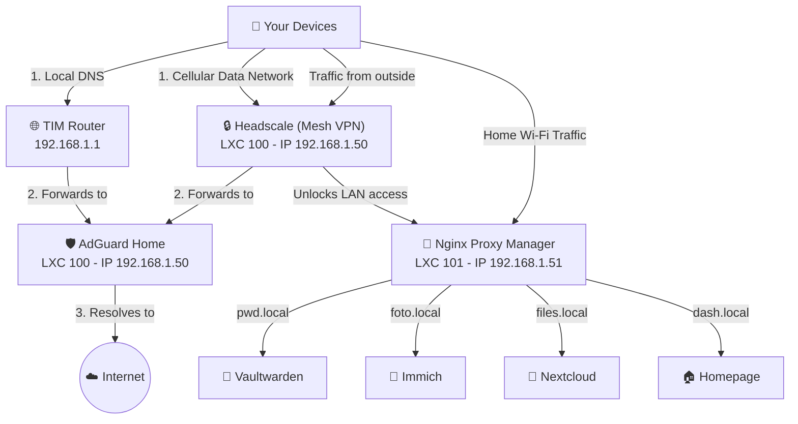
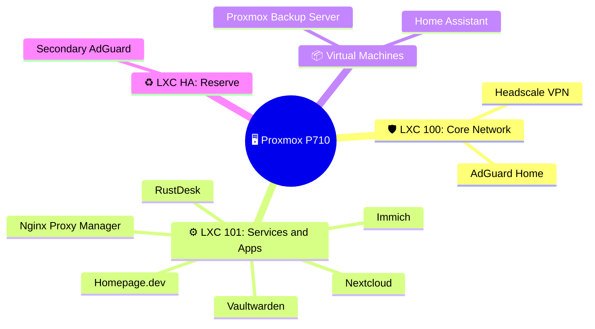
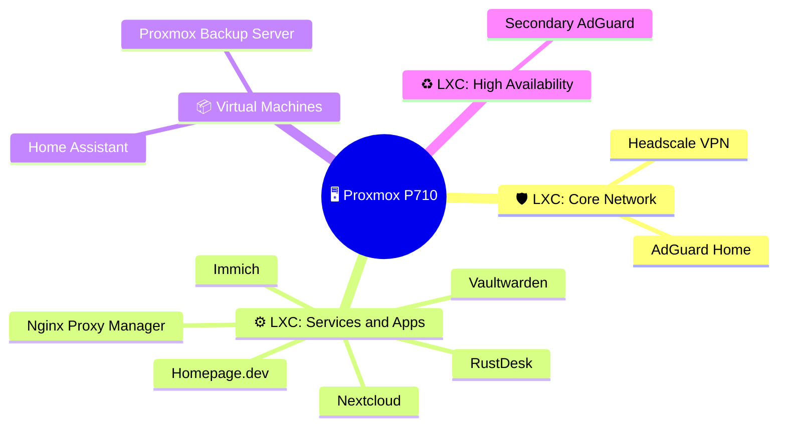

# Infrastructure Plan and Server Map (Homelab)

## Architectural Map

This map describes how the various services will interact with each other and how data will flow in and out of your home network.

To avoid the visual "cable spaghetti" that occurs when mixing network connections and physical boxes, I have divided the map into two much clearer and cleaner diagrams.

### 1. How Data Travels (Network Flow)
This map simply shows who talks to whom.

### 2. Physical Architecture (Where they are located)
This tree map shows the physical separation of the networks without crossing lines.

### 2. How They Are Installed (Proxmox Architecture)
This map shows exactly where services physically "live" inside your server.

## Action Plan (Implementation Phases)

### Phase 1: The Foundations (Remote Access and Network) - IN PROGRESS
- **Goal**: Security, privacy, and remote access without exposing ports to the public.
- **Services**:
  - **Headscale**: The control center for Tailscale. It allows you to create your VPN so that all your devices can "see" each other securely.
  - **AdGuard Home**: Blocks ads and trackers at the DNS level. We will set the router to distribute this DNS to all connected devices in the house.
  - **Secondary AdGuard LXC + Keepalived**: We will install a second LXC container also on Proxmox with Keepalived. If the main container crashes, DNS traffic instantly switches to the reserve one.

### Phase 2: Traffic Forwarding and Core Services (Data Management)
- **Goal**: Manage your own data securely and access services via simple names (e.g., `foto.local`) and with secure certificates.
- **Services**:
  - **Nginx Proxy Manager (NPM)**: The "traffic cop" of the network. It receives traffic and routes it to the correct service.
  - **Vaultwarden**: The password manager. It replaces cloud services like 1Password or Bitwarden.
  - **Immich**: For automatic photo backup, the self-hosted alternative to Google Photos.
  - **Nextcloud / Syncthing**: For file synchronization between devices.

### Phase 3: Monitoring and Dashboard
- **Goal**: Keep your finger on the pulse of the entire server with a beautiful graphical interface and receive alerts if something breaks.
- **Services**:
  - **Homepage**: The gorgeous central dashboard (gethomepage.dev) to keep everything in view.
  - **Beszel**: To graphically monitor the CPU and RAM usage of every single Docker container.
  - **Uptime Kuma**: To continuously ping services. If Vaultwarden goes offline, you receive a message on Telegram or Discord.

### Phase 4: Backup and Remote Control
- **Goal**: Secure data and be able to remotely assist other PCs.
- **Services**:
  - **Proxmox Backup Server (PBS)**: With deduplication enabled to make fast and efficient backups of the whole host and containers. We will install it as a **dedicated VM on Proxmox** (no separate physical machines, everything centralized).
  - **RustDesk**: For remote control of your devices, replacing TeamViewer.

### Phase 5: Identity and Future Expansion
- **Goal**: Centralized authentication. A single login to access all services.
- **Services**:
  - **Authelia or Authentik**: Single Sign-On (SSO) implementation. When you access `foto.local`, you will be redirected to a central login page.
  - **Home Assistant**: Home Automation (can be installed on Proxmox as VM OS to have full control of supervisor and add-ons).
