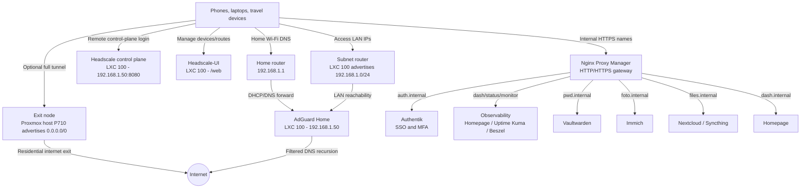
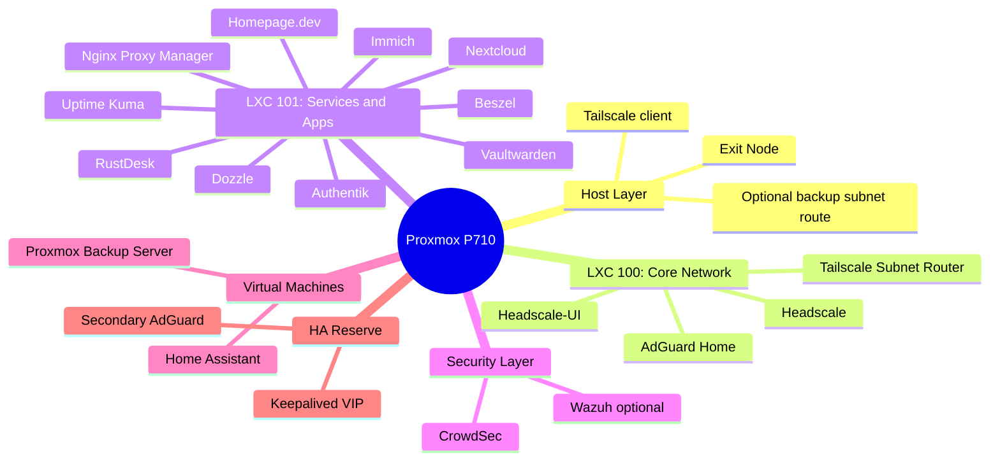

# Infrastructure Plan and Server Map

This map describes how the homelab services interact and where each responsibility lives.

The important design split is:

- **LXC 100** handles DNS, Headscale control plane, Headscale-UI, and the home LAN subnet route.
- **Proxmox host P710** handles the durable full-tunnel exit-node role.
- **Service containers/LXC** host user-facing applications behind Nginx Proxy Manager.

## 1. Network Flow

## 2. Physical Architecture

## Action Plan

### Phase 1: Foundations - COMPLETE / VALIDATION IN PROGRESS

Goal: private remote access, DNS filtering, LAN reachability, and optional full-tunnel exit traffic without exposing unnecessary ports.

Completed or documented:

- **AdGuard Home** for DNS filtering and split-brain rewrites.
- **Headscale** as the private mesh VPN control plane.
- **Nginx Proxy Manager** for HTTPS and `/web` Headscale-UI routing.
- **MagicDNS** forcing remote clients to use AdGuard at `192.168.1.50`.
- **LXC 100 subnet router** advertising `192.168.1.0/24`.
- **Proxmox host exit node** documented in [Runbook 05](doc_05_proxmox_exit_node.md).
- **Headscale hardening** documented in [Runbook 06](doc_06_headscale_hardening.md).

Validation checklist:

- `docker exec headscale headscale nodes list` shows expected clients.
- `docker exec headscale headscale nodes list-routes` shows `192.168.1.0/24` and `0.0.0.0/0` approved where intended.
- A phone on 4G can ping `192.168.1.50`.
- Selecting the Proxmox exit node shows the home Italian public IP.
- DNS continues to resolve through AdGuard Home.

### Phase 2: Identity and Access Control

Goal: add SSO/MFA and protect internal dashboards without making everything public.

Planned services:

- **Authentik** as identity provider.
- **Proxy provider / forward auth** for internal UIs.
- **OIDC for Headscale** as an advanced step after the VPN base is stable.

Runbook: [doc_07_identity_sso_authentik.md](doc_07_identity_sso_authentik.md)

### Phase 3: Observability and Dashboard

Goal: know when DNS, VPN, proxy, identity or apps are failing.

Planned services:

- **Homepage.dev** for navigation.
- **Uptime Kuma** for uptime checks and alerts.
- **Beszel** for host/container metrics.
- **Dozzle** for live Docker logs.

Runbook: [doc_08_observability_dashboard.md](doc_08_observability_dashboard.md)

### Phase 4: Backup and Disaster Recovery

Goal: restore the lab, not only collect backups.

Planned services:

- **Proxmox Backup Server** for VM/LXC backups.
- **restic** for optional encrypted offsite backups.
- Scheduled restore tests.

Runbook: [doc_09_backup_dr.md](doc_09_backup_dr.md)

### Phase 5: Traffic Forwarding and Core Services

Goal: host personal services behind clean internal names and valid HTTPS.

Planned services:

- **Vaultwarden** for passwords.
- **Immich** for photo and video backup.
- **Nextcloud / Syncthing** for file synchronization.
- **Nginx Proxy Manager** as the HTTPS entry point for internal services.

Runbook: [doc_10_core_apps.md](doc_10_core_apps.md)

### Phase 6: Security Operations

Goal: keep the platform maintainable and auditable.

Planned services:

- **CrowdSec** if services are exposed publicly.
- **Wazuh** as advanced SIEM/XDR if resources allow.
- Update, secret rotation and incident-response runbooks.

Runbook: [doc_11_security_operations.md](doc_11_security_operations.md)

### Phase 7: Future Expansion

Goal: expand without weakening the foundation.

Planned services:

- **Home Assistant** as a VM for full supervisor/add-on support.
- **Secondary AdGuard + Keepalived** for DNS high availability.
- **RustDesk** for private remote support.
- **Jellyfin / Paperless-ngx** only after backup and monitoring are stable.

---

**Previous:** [Runbook 11: Security Operations](doc_11_security_operations.md)
