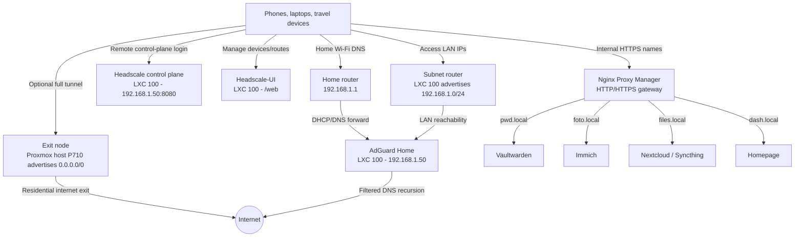
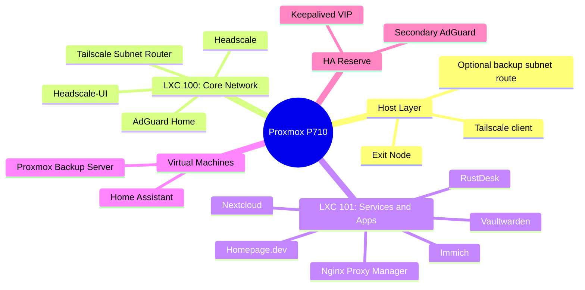

# Infrastructure Plan and Server Map

This map describes how the homelab services interact and where each responsibility lives.

The important design split is:

- **LXC 100** handles DNS, Headscale control plane, Headscale-UI, and the home LAN subnet route.
- **Proxmox host P710** handles the durable full-tunnel exit-node role.
- **Service containers/LXC** host user-facing applications behind Nginx Proxy Manager.

## 1. Network Flow

## 2. Physical Architecture

## Action Plan

### Phase 1: Foundations - COMPLETE / VALIDATION IN PROGRESS

Goal: private remote access, DNS filtering, LAN reachability, and optional full-tunnel exit traffic without exposing unnecessary ports.

Completed or documented:

- **AdGuard Home** for DNS filtering and split-brain rewrites.
- **Headscale** as the private mesh VPN control plane.
- **Nginx Proxy Manager** for HTTPS and `/web` Headscale-UI routing.
- **MagicDNS** forcing remote clients to use AdGuard at `192.168.1.50`.
- **LXC 100 subnet router** advertising `192.168.1.0/24`.
- **Proxmox host exit node** documented in [Runbook 05](doc_05_proxmox_exit_node.md).

Validation checklist:

- `docker exec headscale headscale nodes list` shows expected clients.
- `docker exec headscale headscale nodes list-routes` shows `192.168.1.0/24` and `0.0.0.0/0` approved where intended.
- A phone on 4G can ping `192.168.1.50`.
- Selecting the Proxmox exit node shows the home Italian public IP.
- DNS continues to resolve through AdGuard Home.

### Phase 2: Traffic Forwarding and Core Services

Goal: host personal services behind clean internal names and valid HTTPS.

Planned services:

- **Vaultwarden** for passwords.
- **Immich** for photo and video backup.
- **Nextcloud / Syncthing** for file synchronization.
- **Nginx Proxy Manager** as the HTTPS entry point for internal services.

### Phase 3: Monitoring and Dashboard

Goal: observe service health and receive alerts before failures become incidents.

Planned services:

- **Homepage.dev** for a central dashboard.
- **Beszel** for host/container resource visibility.
- **Uptime Kuma** for HTTP, TCP, and ping checks.

### Phase 4: Backup and Remote Control

Goal: protect the platform and provide private remote assistance tools.

Planned services:

- **Proxmox Backup Server** as a dedicated VM with deduplication.
- **RustDesk** for private remote control.

### Phase 5: Identity and Future Expansion

Goal: centralize authentication and expand the personal infrastructure.

Planned services:

- **Authelia or Authentik** for SSO.
- **Home Assistant** as a VM for full supervisor/add-on support.
- **Secondary AdGuard + Keepalived** for DNS high availability.

---

**Previous:** [Runbook 05: Proxmox Exit Node](doc_05_proxmox_exit_node.md)
